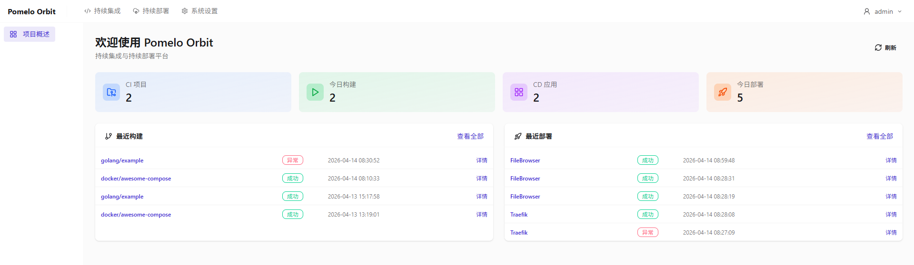
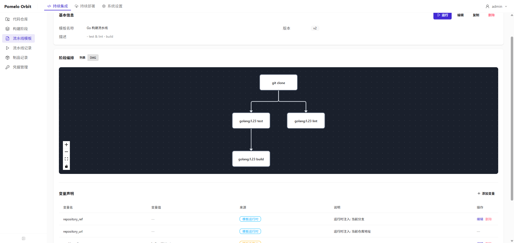
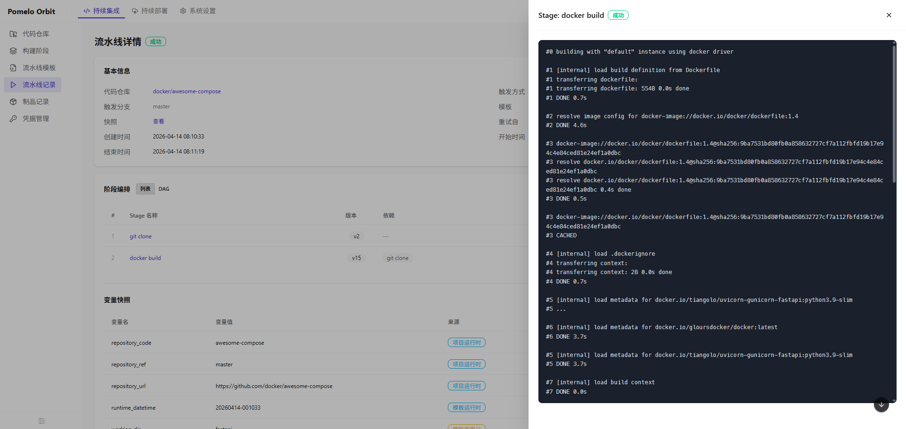
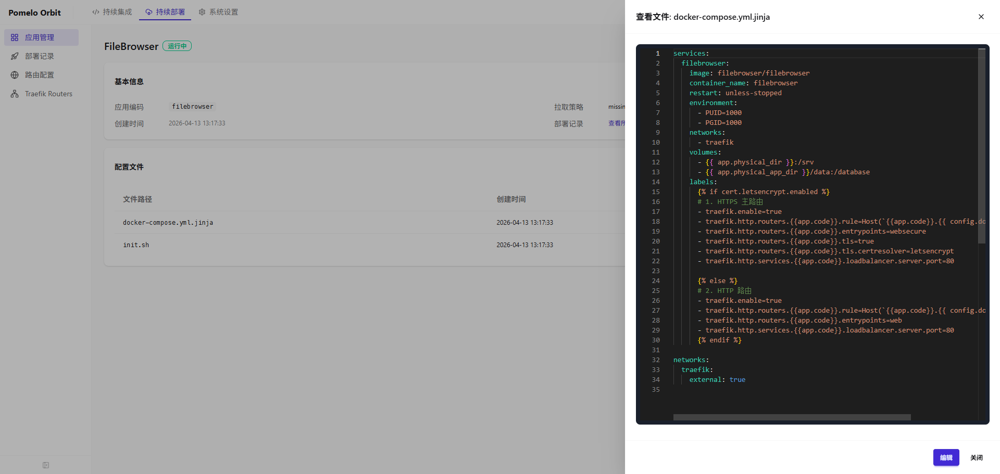
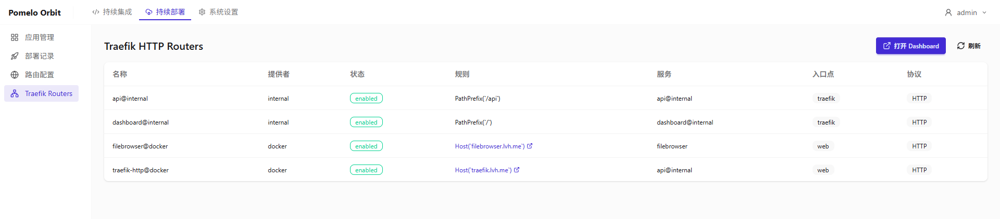

# Pomelo Orbit

为本地容器环境打造的轻量级 CI/CD 平台，覆盖代码构建到容器部署的完整链路，适用于 Windows WSL2、macOS 及 Linux 服务器。



---

## 持续集成（CI）

### Stage — 可复用执行单元

Stage 是流水线的最小执行单元，定义了"用什么镜像跑什么脚本、产出什么制品"，本身不含任何编排信息，可以被多个模板复用。

```
PipelineStage {
  image     // 执行镜像，如 "golang:1.23-alpine"
  script    // Shell 脚本，支持 {{ variable }} 占位符
  artifacts // 制品声明，路径和名称也支持占位符
}
```




### 流水线模板 — DAG 编排

模板将多个 Stage 编排为有向无环图（DAG），通过 `depends_on` 定义依赖关系，没有依赖的 Stage 自动并行执行。

```
clone
  ├── lint    (depends_on: clone)
  └── test    (depends_on: clone)
        └── build  (depends_on: test)
```

lint 和 test 并行，build 等 test 完成后才执行。



---

## 持续部署（CD）

### 应用管理

应用配置（`docker-compose.yml`、环境变量文件、初始化脚本）集中存储在数据库，部署时动态写入文件系统再执行 `docker compose up -d`。支持多环境配置文件（`.env.linux` / `.env.windows`），同一套配置可以在不同环境部署。



---

## 动态路由网关

基于 Traefik，路由规则存储在数据库，变更时实时同步为 Traefik 动态配置文件，Traefik 通过文件监听自动热加载，无需重启网关。

```
Web UI 配置路由
  → 保存到数据库
  → 生成 dynamic/{route}.yml
  → Traefik 自动加载
  → 路由立即生效
```

支持域名路由、路径前缀路由，HTTP/HTTPS 均可配置。



---

## SSL 证书管理

支持三种证书模式，统一在 UI 中管理，自动同步到 Traefik：

| 模式 | 适用场景 | 管理方式 |
|------|----------|----------|
| 手动上传 | 内网域名、自签名证书 | 上传 PEM 文件 |
| mkcert | 本地开发 HTTPS | 一键生成本地信任证书 |
| Let's Encrypt | 公网域名 | Traefik 自动申请和续期 |

---

## 技术栈

| 层级 | 技术 |
|------|------|
| 后端 | Python 3.12 + FastAPI + SQLAlchemy + SQLite |
| 前端 | Vue 3 + Vite + Ant Design Vue + TypeScript |
| 网关 | Traefik |
| 容器 | Docker + docker-compose |

---

## 快速开始

```bash
make install       # 安装依赖
make dev-backend   # 启动后端（端口 10001）
make dev-frontend  # 启动前端（端口 10002）
```

访问 [localhost:10002](http://localhost:10002)，默认账号：admin / admin

> **端口说明**: 使用 10001/10002 端口是为了避免 Windows 系统保留的端口范围 (8909-9008)。

```bash
make help    # 查看所有命令
make lint    # 代码检查
make test    # 单元测试
make build   # 镜像构建
```

部署指南：[docs/guides/docker-deployment.md](docs/guides/docker-deployment.md)

## 许可证

MIT License
