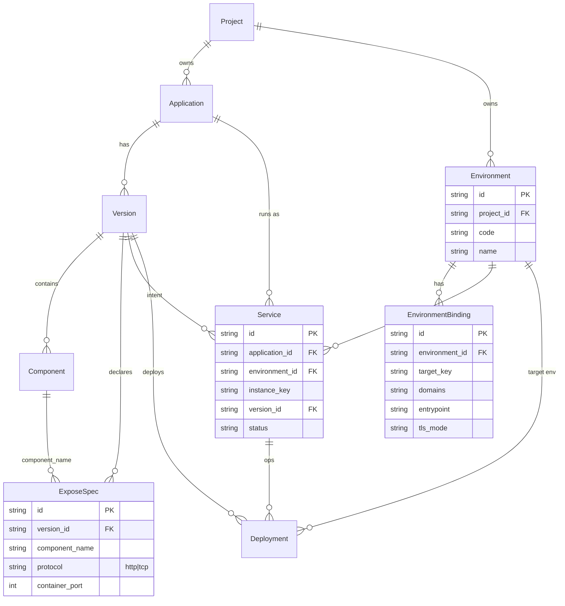

# CD Environment / Expose / Service 基数（P0 修订）
最后修改时间: 2026-07-22 08:35:55

Review status: **Accepted**

Flow mode: standard

Parent cadence: `docs/requirement/20260721-cd-application-version-cadence.md`（**修订 R1**）

**后继修订 R2（Draft / strict，未改写本文 Accepted 正文）**：  
`docs/requirement/20260722-cd-environment-ingress-policy.md`  
— 环境 **IngressPolicy** 取代 **EnvironmentBinding 用户 SoT**（手填域名 / 环境侧选 component）。  
R2 Accepted 后，与本文 **D4** 冲突时以 **R2** 为准；R1 的 Project 归属、Expose、多 Service、Traefik MVP 单 ingress **仍有效**。

Supersedes（部分推翻）:

| 原决策 | 文档 | 处理 |
|--------|------|------|
| Environment 仅概念、不实现 | cadence #3、domain Environment | **修订**：Environment 为 **Project 下业务实体** |
| 对外访问本期不进版本化闭环 | cadence #14 | **修订**：expose 进 Version；环境接入进 Environment |
| Application → Service 1:0..1 | domain 基数 | **修订**：一 App 多 Service |
| ApplicationRoute 挂 domain+port@app | 现状实现 | **废止语义**；拆入 Version expose + Environment 绑定 |
| Environment 与 Project 松散、无 project_id | 本文早期 D2 / 讨论稿 | **更正（2026-07-21）**：Environment **归属 Project** |

不推翻：Version 结构化 SoT、deploy 必选 Version、published 不可变、无 raw compose、force recreate 为操作选项。

## Terminology / 规范用词（Accepted）

| 中文 | 英文 | 说明 |
|------|------|------|
| 暴露规格 | **ExposeSpec** | Version 内：协议 + 容器端口等；**无域名** |
| 环境 | **Environment** | **Project 下业务数据**；投放目标；**有** `project_id`；**无** `application_id` |
| 环境接入绑定 | **EnvironmentBinding**（工作名） | Environment 上：如何把某次部署的 expose 接到域名/入口/证书 |
| 实例键 | **instance_key** | Service 实例维度；默认 `default` |
| 接入目标 | **ingress target** | 某 (Application, Environment) 上实际写入 Traefik labels 的那条 Service |

## Background / 背景

P0–P3 已落地 Version/Component/Service/Deployment 与 Render(Version)。  
路由仍用 `application_route(domain+port@Application)`，把 **规格（端口/协议）** 与 **环境参数（域名）** 揉在一起，且 Environment 未实体化。

用户修订：

1. Version 必须承载基本路由/暴露定义（含 **HTTP 与 TCP 同批**）。
2. Traefik 域名等属 Environment。
3. 二者合成才构成完整 Deployment 渲染输入。
4. Environment **归属 Project**：切换项目后在项目内维护环境业务数据；**不**做跨 Project 共享 Environment。
5. 同一 Application **可多 Service**（如本机 81/82 两套 nginx）；Traefik 多挂复杂，MVP 限制接入基数。

## Goal / 目标

1. 钉死 Version / Environment / Service / Deployment 在「对外访问」上的归属。
2. 钉死 Environment **归属 Project**（`project_id`）；列表/录入随当前项目；deploy 校验同项目。
3. 钉死 Service 唯一键与 Traefik MVP 接入策略。
4. 钉死 HTTP|TCP 同批进入 Expose + Render 协议分支（禁止 HTTP-only 死结构）。

## Non-goal / 非目标

1. 不定最终 DDL/索引/JSON Schema 正则（归 Plan）。
2. 不定完整密钥库、多集群 K8s 投放细节。
3. **不**在本文件实现产品代码。
4. **不做**同域名多实例负载均衡 / 蓝绿产品流（可后开）。
5. **不**保留 `application_route` 作为长期 SoT。

## Decisions / 决策（Accepted 2026-07-21）

### D1 — 归属切分

| 归属 | 内容 | 禁止 |
|------|------|------|
| **Version / ExposeSpec** | `protocol`（`http` \| `tcp`）、`container_port`、关联 `component_name`；HTTP 可选 path 等**规格**字段 | domain、证书、entrypoint 主机绑定 |
| **Environment** | 归属 Project；名称/编码、入口、证书默认策略、**域名与接入参数**、EnvironmentBinding | 协议/端口规格；跨 Project 共享 |
| **Deployment** | 操作记录；输入含 version + environment + options | 双记运行真相 |
| **Service** | 运行绑定：app + version + environment + instance_key + status | 把域名写进 Service 当规格 |

合成：

```text
Render(Version.ExposeSpec × Environment.Binding[+入口/证书]) → compose / labels → apply
```

### D2 — Environment 归属 Project（更正 Accepted）

1. Environment 是 **Project 下业务实体**；**必须** `project_id` FK → Project。
2. **不得** `application_id`（环境不是某个应用私有配置表；同项目多应用可投到同项目内不同/相同 Environment）。
3. 切换 Project 后：Environment 列表/创建/编辑均在 **当前项目** 上下文中（与 Application 相同产品习惯）。
4. **禁止**跨 Project 引用 Environment：deploy 时 `application.project_id` **必须等于** `environment.project_id`，否则校验失败。
5. 权限：项目成员（或项目内 CD 写权限）管理本项目 Environment；**不**做平台级跨项目 Environment 目录。
6. 业务唯一建议：`(project_id, code)` 唯一。

### D3 — ExposeSpec（Version 内，HTTP|TCP 同批）

1. Expose 从属于 Version（随 published 不可变）。
2. 必填：`component_name`（= Component.name）、`protocol` ∈ {`http`,`tcp`}、`container_port`。
3. **HTTP 与 TCP 同一模型、同一 Render 合路**；`protocol` 仅分支生成规则，禁止先做 HTTP-only 再硬插 TCP。
4. 校验建议：
   - http：Environment 侧若启用对外接入，binding 需域名等 HTTP 参数。
   - tcp：domain 非必填；需入口/暴露方式等 TCP 环境参数。
5. Component.`ports_json` 与 ExposeSpec 的关系：Plan 对齐；**对外意图以 ExposeSpec 为准**，避免双 SoT。

### D4 — EnvironmentBinding

> **R2 预告（2026-07-22）**：用户 SoT 形态将被  
> `20260722-cd-environment-ingress-policy.md` **修订**（环境级策略 + Deploy 推导域名；禁止环境 CRUD component）。  
> 下列 1–4 描述 **R1 已交付** 语义，在 R2 Accepted 前仍为历史实现依据。

1. 挂在 Environment，不挂 Application。
2. 对齐键：稳定对齐 Expose（推荐 `component_name + protocol + container_port`，或 Version 内稳定 expose key；Plan 定一种）。
3. 承载：domains[]（HTTP）、entrypoint、tls_mode、TCP 入口相关参数等。
4. 同一 Environment 内冲突检测（同 Host+path、同 TCP 入口/端口/SNI）属 **该 Environment 资源占用**（ naturally 落在同一 Project 内）。

### D5 — Service 基数

1. **允许**同一 Application 多条 Service（多环境、多实例）。
2. 业务唯一键：`(application_id, environment_id, instance_key)`。
3. `instance_key` 默认 `default`；第二套实例如 `82` / `blue`。
4. **废止**「Application 在本机 0..1 Service」作为领域铁律。

### D6 — Traefik 接入 MVP（与多 Service 解耦）

1. **运行**与 **接入** 分离：Service 可多条运行；不强制每条都进 Traefik。
2. MVP：**每个 (application_id, environment_id) 至多一个 ingress target**（写入 Traefik labels 的 Service）。
3. 多实例共存时：仅 **primary**（或显式指定的 instance）进 labels；其余可仅 host 端口/内网。
4. Router 名必须可派生且唯一，例如：  
   `{app_code}-{env_code}-{instance_key}-{component}-{protocol}`  
   禁止多实例抢固定名 `routers.web`。
5. 同域名多实例 LB、多接入、蓝绿：**非 MVP**，另开需求。

### D7 — 部署输入与顺序

```text
deploy(application_id, version_id, environment_id, instance_key?, options)
  ① Service upsert(app, env, instance_key) → version_id, status=deploying
  ② Render(Version + ExposeSpec, Environment + Binding) → 产物
  ③ apply
  ④ Container；Service = running | faulted
  Deployment 记录 version_id、environment_id、service_id、options
```

1. deploy **必选** `version_id` 与 `environment_id`（Environment 落地后）。
2. 缺 binding 或 expose 与 binding 对不齐 → **校验失败**，不 silent skip（Plan 可定义「仅内部端口、不要求对外」的 opt-out）。

### D8 — 现状废止方向

1. `application_route`（domain+port@Application）**不再作为长期 SoT**。
2. `Application.route_managed` 语义下沉/替换为 Environment 侧「是否/如何接入」（Plan 定迁移）。
3. 当前实现中 `RenderCompose` 读 Application routes 注入 labels：**过渡**；目标改为 Version×Environment。

## User scenarios / 用户场景

1. 在 Version 上声明 `web:http:80` 与 `redis:tcp:6379`；不含域名。
2. 切换到项目 A，创建 Environment `staging` / `prod`，配置 binding（域名/入口）。
3. 项目 A 内 app1@v3 部署到本项目 `prod`；切换项目 B 后看到的是 **B 自己的** Environment 列表，**不能**选 A 的 `prod`。
4. 同 app 在同一 env 起 `default` 与 `82` 两个 Service；仅 `default` 挂 Traefik 域名，`82` 本机调试。
5. 改域名只改 Environment，**不必** publish 新 Version；改端口/协议必须改 Version（或 unpublished 编辑）。

## Acceptance / 验收（文档级）

1. 无 Open question 阻塞 D1–D8。
2. ER 基数：Environment → Project（N:1）；Service 含 environment_id + instance_key；deploy 强制 app 与 env 同 project。
3. Expose 协议枚举含 http 与 tcp；Render 合路描述存在。
4. Traefik MVP 接入基数写明；与多 Service 运行基数分离。
5. 明确废止 application_route 长期 SoT。

## Open questions / 待讨论

**无。**（实现向细节归 Plan）

| 归 Plan | 说明 |
|---------|------|
| Expose 表 vs Component 子结构 | 存储形态 |
| Binding 对齐键具体列 | component+protocol+port vs expose_id |
| Environment 权限模型 | 独立授权表/角色 |
| 无对外 expose 的 deploy | 是否允许零 Binding |
| application_route 数据迁移 | DROP 前是否一次性迁移到 Env（无历史兼容压力时可为空环境） |
| compose project 名 / 工作目录 | 多 instance 如何隔离 |

## UML ER / 概念修订



### 关系与基数（修订）

| 关系 | 基数 |
|------|------|
| Project → Environment | **1:N**（归属；`(project_id, code)` 唯一） |
| Application → Service | **1:N** |
| Environment → Service | 1:N（且 app 与 env 必须同 project） |
| Service 唯一 | `(application_id, environment_id, instance_key)` |
| Version → ExposeSpec | 1:N |
| Environment → EnvironmentBinding | 1:N |
| (application, environment) → ingress target | MVP **0..1**（运行 Service 仍可 N） |

## Risk / 风险

1. 现网 `application_route` 与 Render 注入需迁移窗口；无双轨则应一次性切换。
2. 忘记 deploy 同项目校验会导致串项目投放（须硬校验）。
3. Router 名/compose project 名未按 instance 隔离时，多 Service 会撞车。
4. TCP 与 HTTP 同批要求 Render 从一开始协议化分支，避免标签写死。

## Plan gate

实现须另开 Plan（建议名：`cd-environment-expose`），至少覆盖：

1. migration：`environment`、expose、binding；`service` 增加 `environment_id` + `instance_key`；废弃 `application_route` 路径。
2. deploy API：`version_id` + `environment_id` + optional `instance_key`。
3. `Render(Version, Environment)` 替换仅 Version + ApplicationRoute。
4. Traefik labels：http/tcp 分支 + 唯一 router 名；ingress MVP 规则。
5. 前端：Version 编 expose；Environment 编域名/入口；部署选择 env/instance。

**在 Plan Accepted 前，不在本修订上自动改代码。**

## User review notes

- 2026-07-21：用户要求 Version 承载基本路由定义（协议/端口）；域名等属 Environment；合成为 Deployment。
- 2026-07-21：否决 Environment.application_id。
- 2026-07-21：曾讨论 Environment 与 Project 松散；**更正**：Environment **归属 Project**，切换项目维护本项目环境，不做跨项目环境目录。
- 2026-07-21：Plan 同步更正（`project_id`、同项目 deploy、按项目 seed local）；仍待用户接受 Plan 后 Implementation。
- 2026-07-21：TCP 与 HTTP 同批进模型与 Render，避免后塞。
- 2026-07-21：一 App 多 Service 合理；Traefik 多挂未完全想清 → MVP 限制每 (app,env) 一个 ingress target。
- 2026-07-21：用户 **接受** 决策 → 本文 Accepted；同日更正 D2 归属 Project。
- 2026-07-22：cadence 标为 **R1**；后继 **R2** ingress-policy 挂索引；D4 加 R2 预告，不改 Accepted 状态。
