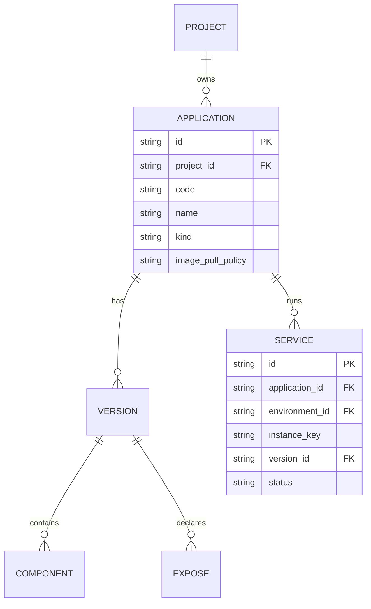

# CD Application kind（gateway / standard）规格
最后修改时间: 2026-07-22 13:06:52

Review status: Accepted

Flow mode: strict

## Requirement basis

| 文档 | 状态 |
|------|------|
| `docs/requirement/20260722-cd-application-kind-gateway.md` | **Accepted**（进入 Spec） |
| `docs/requirement/20260721-cd-application-version-cadence.md` | Accepted；本 Spec = **修订 R3** |
| `docs/requirement/20260722-cd-environment-ingress-policy.md` | R2 Accepted；standard labels 合路底座 |
| `docs/verification/20260722-cd-environment-ingress-policy.md` | R2 Accepted |

**硬约束（来自 Requirement，不得偏离）**：

1. `Application.kind` ∈ {`standard`, `gateway`}；默认 `standard`；**创建后不可修改**。  
2. **Render 按 kind 分支**；禁止 `code==traefik` 作为主分支条件。  
3. gateway **仍使用** Version / Component（及可选 Expose）统一规格管线；**不**为 gateway 另立 Component/端口数量等特殊校验。  
4. **废止** `attach_ingress` / `Service.is_ingress` 产品 SoT。  
5. standard：是否写 Traefik labels 由 **Version.Expose** 决定（有则写，无则不写）。  
6. 每 Project **不限制** gateway 数量。  
7. E5（gateway 挂载细节 + **补齐 Component 全规格**）**非** R3 必交付；不另开扩展号。  
8. 无双轨；仅新增 migration；Preview 与 Deploy 同一 Render 入口。

## Overview / 概览

```text
Deploy / Preview
  → load Application, Version(+Components, Exposes), Environment, Service
  → branch on Application.kind
  → standard | gateway 渲染策略
  → apply (deploy only)
```

- **standard**：业务 compose +（有 Expose 时）R2 labels。  
- **gateway**：同一套 Component→service 物化管线；**kind 只决定走哪条渲染策略**，不把 gateway 变成「另一种校验体系」。  
- 现网 / bak `data/cd(.bak)/traefik/docker-compose.yml` 仍是**形态参考**，不是 R3 必须逐项复制的验收标准；与参考对齐的 **Component 全规格补齐 + 挂载** 归 **E5**（不另开任务）。

### 域名相关：`domain_suffix` 指什么（澄清）

| 概念 | 是什么 | 不是什么 |
|------|--------|----------|
| 设置/配置 `traefik.domain_suffix`（键常写作 `traefik__domain_suffix`） | 历史平台侧 **自动生成域名用的后缀**（如 `lvh.me`） | **不是** Docker 网络名，**不是** compose service 名 |
| R2 `Environment.base_domain` / `domain_template` | 当前 Deploy 推导 **HTTP Host** 的环境策略（产品 SoT） | 与 container/service 命名无关 |
| Docker `networks.*.name` | 容器网络名 | R3 **不**硬编码平台网络常量 |

**结论**：讨论「自动生成域名」时说的 domain_suffix / base_domain，只影响 **Host 字符串**；与下面的 **compose 服务名 / 容器名** 是两条线。

### 命名：三层不要混（R3）

Docker Compose 里有三层名字，R3 **分开定义**，避免「组件名改了 / depends_on 要映射」的歧义：

| 层 | 来源 | 例子（app=`alist`，组件=`redis`） | 谁引用它 |
|----|------|-----------------------------------|----------|
| **Component.name** | Version 规格（用户填写） | `redis` | Expose.component_name、depends_on **规格内** |
| **compose service 键** | Render：**等于** Component.name | `services.redis` | compose 的 `depends_on`、labels 挂在哪个 service 下 |
| **container_name**（容器名） | Render：拼接 | `alist_redis` | Docker 里看到的容器名；**不是** depends_on 目标 |

**用户要求对齐**：

1. **只改容器名可读性**：`container_name = {app_code}_{component_name}`。  
2. **不改组件名**：Component.name 仍是 `redis`；**不**把规格里的组件改成 `alist_redis`。  
3. **depends_on 不映射**：写出 compose 时 `depends_on` 仍写 **service 键 = Component.name**（如 `redis`），**不是** container_name。Compose 规范就是 depends_on 引用 service 键。  
4. **早期简单规则**，避免 Render 再搞复杂 sanitize：  
   - `application.code`：已有/保持 `^[a-z][a-z0-9-]*$`（创建）。  
   - `component.name`：**同一字符类** `^[a-z][a-z0-9-]*$`（创建/保存 Version 时校验；非法直接失败）。  
   - **禁止** code/component 名含 `_`，以便 `_` **只**作 `app_code` 与 `component_name` 的拼接符。  
   - 因此 `container_name = app_code + "_" + component_name` 为 **纯拼接**，不做字符替换式 sanitize。  
   - 长度：各段沿用现有上限（如 code ≤100）；拼接后若超 Docker 名长度限制再在 Render 报错（罕见）。

**不做**：把 service 键改成 `alist_redis` 再「映射 depends_on」——那是上一版错误表述，已废止。

### 占位 compose 示例（消除歧义）

假设：`application.code = alist`，Version 含组件 `redis`、`api`（api depends_on redis），env=`local`，instance=`default`。  
Compose project 名仍为既有规则（如 `alist-local-default`），与容器名无关。

```yaml
# 占位示例 — R3 目标形态（非现网抄录）
# Component.name 未改；depends_on 用组件名；仅 container_name 带 app 前缀
services:
  redis:
    image: redis:7
    container_name: alist_redis
  api:
    image: myapi:1
    container_name: alist_api
    depends_on:
      - redis
    # 若有 Expose + IngressPolicy，labels 写在本 service（键仍是 api）下：
    # labels:
    #   - traefik.enable=true
    #   - traefik.http.routers....rule=Host(`alist.local.test`)
```

同项目另一应用 `blog` 也有组件 `redis` 时：

```yaml
services:
  redis:
    image: redis:7
    container_name: blog_redis   # 与 alist_redis 区分
```

两应用 **compose project 不同**；容器名也因 app_code 前缀不同。`depends_on: [redis]` 各自文件内仍指向本文件的 service 键 `redis`。

## Design decisions / 设计决策

| ID | 决策 | 说明 |
|----|------|------|
| D-Kind | 列 `application.kind` | `NOT NULL DEFAULT 'standard'`；迁移回填 `standard` |
| D-Immutable | kind **仅创建可写** | **Update 契约不含 kind 字段** → 客户端无法改 kind |
| D-Enum | 仅 `standard` \| `gateway` | 创建时非法值失败 |
| D-VersionPipe | gateway = 普通应用的规格管线 | 同一 Version/Component/Expose CRUD；**不**限制 Component 个数、端口个数 |
| D-NoSpecialValidate | gateway **无**额外 Render/业务校验 | 校验与 standard 共用 |
| D-RenderBranch | `RenderCompose` 读 `app.kind` | 顶层策略分支；**不得**用 app.code 特判 |
| D-StandardLabels | labels 条件 = 存在 Expose | 删除 `service.IsIngress` 门闩 |
| D-NoAttach | 删除 Deploy/Preview `attach_ingress` | proto/DTO/UI 删除 |
| D-NoIsIngress | DROP `service.is_ingress` | 去掉 ClearOtherIngress 等逻辑 |
| D-GatewayParity | gateway 物化以 Component 为准 | R3 允许与 standard 高度重合，仅保留 kind 分支钩子 + 测试区分 |
| D-NameRules | app.code / component.name 早期简单规则 | `^[a-z][a-z0-9-]*$`；禁止 `_`；创建/保存即失败，Render 不 sanitize |
| D-ContainerName | `container_name = app_code + "_" + component_name` | **纯拼接**；service 键仍 = Component.name；depends_on **不**改写 |
| D-Net | **不**在 R3 硬编码 Docker 网络名 | 与 domain_suffix / base_domain 无关 |
| D-NoProviderField | 本期不建 provider 列 | |
| D-Count | 不限制 gateway 应用数 | |
| D-Migration | 开发期就地改现有文件 | `000002` +kind；`000009` 无 is_ingress；无 `000011` |
| D-API / D-UI | 见 Interfaces | 创建选 kind；详情只读展示；Deploy 无 attach |

### Requirement 闭合映射

| Req | Spec |
|-----|------|
| Q1 kind 不可改 | D-Immutable（Update 无字段） |
| Q2 Version/Component | D-VersionPipe, D-NoSpecialValidate |
| Q3 不限制数量 | D-Count |
| Q4 废止 attach/is_ingress | D-NoAttach, D-NoIsIngress, D-StandardLabels |
| Q5 挂载后续 | E5：挂载契约 + 补齐 Component 全规格（ports/command/mounts/networks 等）；R3 无强制注入 |

## ER diagram / 实体关系（R3 增量）



| 字段 | 说明 |
|------|------|
| APPLICATION.kind | `standard` \| `gateway`；仅创建写入 |
| SERVICE | **无** is_ingress |

## Render contracts

### 共用

- 输入：`RenderInput{App, Version, Components, Exposes, Env, Service}`（不依赖 IsIngress）。  
- 输出：compose YAML（形态见上方占位示例）。  
- Preview / Deploy 同一函数。  
- Component → service 字段映射 **standard 与 gateway 共用**。  
- **service 键** = `Component.name`（不变）。  
- **container_name** = `app.Code + "_" + Component.name`（D-ContainerName；前置 D-NameRules）。  
- **depends_on** = 规格中的组件名列表原样写出（即 service 键），**禁止**改成 container_name。  
- **labels**：挂在 Expose 对应 component 的 **service 键** 下。

### standard（`kind=standard`）

1. 渲染全部 Component → services（键=组件名 + 写 container_name）。  
2. **若存在 Expose**：R2 `injectExposeLabels`；缺策略失败。  
3. **若无 Expose**：不写 labels；不强制 base_domain。  
4. 不因 code 名进入 gateway 分支。

### gateway（`kind=gateway`）

1. **同一套** 物化与命名规则（无额外 ports/Component 数量校验）。  
2. Expose：有则 labels，无则不加。  
3. R3 **不**强制平台网络块 / docker.sock/acme，**也不**要求 Version 已填满参考 compose 的 Component 字段（**E5** 补齐）。  
4. 可测的 kind 分支钩子；策略体 R3 可与 standard 高度重合。

### 非目标（Render）

- 硬编码 Docker 网络名 / 与 domain_suffix 绑定网络。  
- gateway 专用 ports/Component 数量校验。  
- E1 / E5 / host / K8s（E5 范围见 Requirement 扩展表，含 Component 全规格）。

## Interfaces

### Proto / HTTP

| 面 | 变更 |
|----|------|
| `ApplicationCreateReq` | 增加 `optional string kind`；缺省 `standard` |
| `ApplicationUpdateReq` | **不包含** `kind` |
| `ApplicationResp` | 增加 `string kind` |
| `ApplicationDeployReq` | **删除** `attach_ingress` |
| Preview | **删除** `attach_ingress` |
| Service 视图 | **删除** `is_ingress` |

### Usecase / DTO / Frontend

- Create normalize kind；Update 无 Kind。  
- Deploy/Preview 无 AttachIngress；Service 无 IsIngress。  
- Render：`switch app.Kind`。  
- UI：创建可选 kind；详情只读；Deploy 无 attach；Services 无 is_ingress 列。

## Migration（开发期就地）

1. `000002`：`application.kind` NOT NULL DEFAULT `standard`。  
2. `000009`：service 无 `is_ingress`。  
3. **不**新增增量 migration（开发阶段）。

## Affected components

schema 就地（000002/000009）；model/repo；compose_renderer + deploy/preview；application create；proto；handler；web；tests（migrate **10**）。

## Technical questions

| # | 结论 |
|---|------|
| T1 Docker 网络名 | R3 不定硬编码名 |
| T2 gateway ports/Component 数 | 无特殊规则 |
| T3 kind 不可改 | Update 无 kind 字段 |
| T4 is_ingress 互斥 | 删除 |
| T5 domain_suffix | **自动生成域名后缀**（历史配置）；Host 现以 R2 base_domain 为主；与容器名无关 |
| T6 容器名 | `container_name = app_code + "_" + component_name`；service 键/depends_on 仍用组件名 |
| T7 命名规则 | app.code / component.name：`^[a-z][a-z0-9-]*$`，无 `_`；早期校验，Render 不 sanitize |

## Risks

1. gateway/standard 渲染暂时几乎相同 → 可接受。  
2. 删除 attach/is_ingress 改动面大。  
3. 建错 kind 只能删建。

## Alternatives（否决）

code 魔法分支；保留 is_ingress；gateway 强制 ports/网络常量；R3 全量挂载。

## Acceptance（Spec 级）

1. 与 Requirement Q1–Q5 一致。  
2. kind + Update 无字段 + 废止 attach/is_ingress 清单完整。  
3. Render 分支存在；gateway 无额外数量/端口校验。  
4. 不把 domain_suffix 写成 Docker 网络名。  
5. 开发期 schema 就地改、无 000011；E5（挂载 + Component 全规格）非必交付。

## User review notes

- 2026-07-22：初稿 Draft；按用户澄清修订网络/校验/Update。  
- 2026-07-22：用户「开始 plan」→ **Spec Accepted**，进入 Plan。  
- 2026-07-22：澄清 domain_suffix=**自动生成域名**后缀。  
- 2026-07-22：纠正命名——**仅 container_name** = `app_code_component`；service 键/depends_on 仍为组件名；早期简单字符规则；占位 compose 示例入 Spec。  
- 2026-07-22：Verification **Accepted**。
