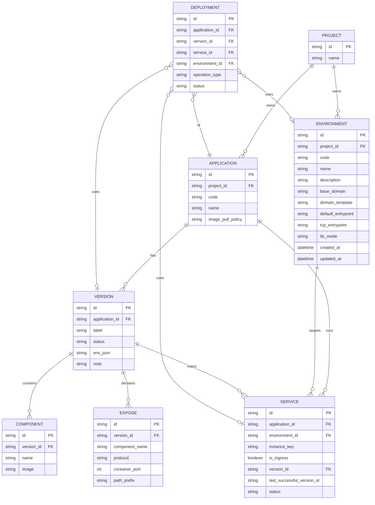
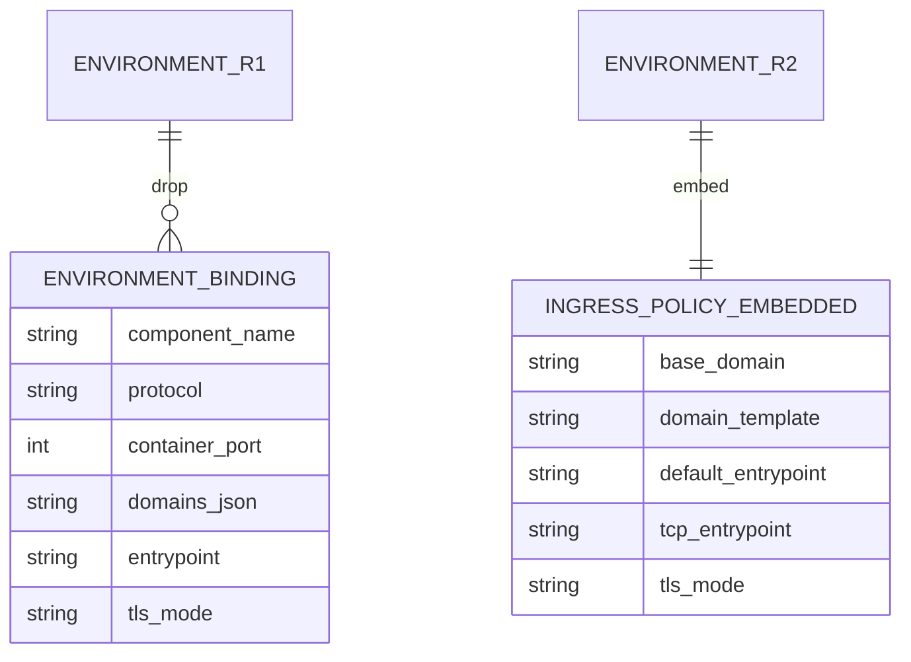

# CD Environment 接入策略（IngressPolicy）规格
最后修改时间: 2026-07-22 09:05:11

Review status: Accepted

Flow mode: strict

## Requirement basis

| 文档 | 状态 |
|------|------|
| `docs/requirement/20260722-cd-environment-ingress-policy.md` | **Accepted**（进入 Spec） |
| `docs/requirement/20260721-cd-application-version-cadence.md` | Accepted；本 Spec = **修订 R2** |
| `docs/requirement/20260721-cd-environment-expose-service.md` | Accepted（R1）；本 Spec **修订** D4 Binding 用户 SoT |
| `docs/plan/20260721-cd-environment-expose-service.md` | Accepted；已实现，本 Spec 定义其接替形态 |

**硬约束（来自 Requirement，不得偏离）**：

1. Deploy 仍生成 Traefik labels；合路 = `Version.Expose × Environment.IngressPolicy × Application`。
2. 域名默认由环境策略推导，**不**要求用户 per-expose 手填。
3. Environment **禁止**以 component 为用户配置维度。
4. **删除** `environment_binding` 用户 SoT（表删除，见 D-Store）。
5. 无双轨 / 无历史兼容；不恢复 `application_route`。
6. 保留 Project 级 Environment、Expose、多 Service、Traefik MVP 单 ingress。

## Overview / 概览

R1 将对外接入拆成 Expose（Version）+ Binding（Environment 按 component 接线）。R2 将 Environment 侧改为 **1 环境 1 套 IngressPolicy**（列落在 `environment` 表），Render 在 **已选定 Version** 时用策略推导 Host/entrypoint/TLS。

```text
用户配置
  Environment.IngressPolicy   （环境级：base_domain / template / entrypoint / tls）
  Version.Expose[]            （版本级：component + protocol + port [+ path]）

Deploy(app, version, env, instance, attach_ingress)
  → 若需 ingress：labels = f(policy, app.code, env, exposes)
  → compose apply
```

## Design decisions / 设计决策

| ID | 决策 | 说明 |
|----|------|------|
| D-Store | **DROP `environment_binding`** | 策略列落 `environment`；不做内化缓存表 |
| D-Policy | IngressPolicy **内嵌 Environment** | 不另建 `ingress_policy` 表（1:1 无必要） |
| D-Template | 默认主 Host = `{app_code}.{base_domain}` | 模板字段可覆盖；MVP 每 (app, env) 一个主 Host |
| D-MultiHTTP | 多 HTTP Expose 共用主 Host | path 用 `expose.path_prefix`；空则 `/`；同 path 冲突校验失败 |
| D-TCP | TCP 用策略 `default_entrypoint` | 无域名；可选 `tcp_entrypoint` 覆盖；SNI 默认 `{app_code}.{base_domain}` |
| D-Validate | 仅在需要写 HTTP labels 时校验策略完整 | `attach_ingress=true` 且存在 `protocol=http` 的 expose |
| D-Seed | seed `local`：`base_domain=local.test`，`default_entrypoint=web`，`tls_mode=none` | 新建 Project 同步 |
| D-Override | **不做** Application×Environment 域名覆盖 | 本期 Non-goal |
| D-API | 删除 Binding 替换 API；Environment CRUD 带策略字段 | 见 Interfaces |
| D-UI | Environment 页去掉「绑定配置」；表单编策略字段 | Version Expose 选 component **保留** |
| D-Migration | 新增 `000010_*` | ALTER environment + DROP environment_binding；不改 000001–000009 已执行文件 |

### Requirement Open questions 闭合（Spec 拍板）

| # | 结论 |
|---|------|
| Q1 | 默认模板 `{app_code}.{base_domain}`；存 `base_domain` + 可选 `domain_template`（空则用默认） |
| Q2 | 多 HTTP expose：共用主 Host + `path_prefix`；path 规范化后冲突 → 失败 |
| Q3 | 环境级 `default_entrypoint` + 可选 `tcp_entrypoint`（空则回落 default）；不设 entrypoint 列表 |
| Q4 | **删除** `environment_binding` 表 |
| Q5 | 应用级覆盖 **不做** |
| Q6 | `local`：`base_domain=local.test`，`default_entrypoint=web`，`tls_mode=none`，`domain_template` 空 |
| Q7 | `attach_ingress=false` 或不存在 http expose → **不**强制 `base_domain` |

## ER diagram / 实体关系图

### 目标态（R2）



**字段注释（不写在 mermaid 属性行内，避免解析失败）**：

| 实体.字段 | 说明 |
|-----------|------|
| APPLICATION.code | 与 project 联合唯一（业务） |
| ENVIRONMENT.code | `(project_id, code)` 唯一 |
| ENVIRONMENT.base_domain / domain_template / default_entrypoint / tcp_entrypoint / tls_mode | **IngressPolicy 内嵌列** |
| ENVIRONMENT.tls_mode | `none` \| `letsencrypt` \| `tls` |
| VERSION.label | `(application_id, label)` 唯一 |
| VERSION.status | `unpublished` \| `published` |
| EXPOSE.component_name | Version 内组件名，逻辑对齐 Component.name，无 FK |
| EXPOSE.protocol | `http` \| `tcp` |
| SERVICE | 唯一 `(application_id, environment_id, instance_key)` |

**基数要点**：

| 关系 | 基数 | 备注 |
|------|------|------|
| Project → Environment | 1:N | `(project_id, code)` 唯一 |
| Environment → IngressPolicy | **1:1 内嵌** | 无独立表；无 Binding 子表 |
| Version → Expose | 1:N | `(version_id, component_name, protocol, container_port)` 唯一 |
| Expose → Component | 逻辑 N:1 | 仅名字对齐，**无 FK**（与 R1 一致） |
| Application → Service | 1:N | `(application_id, environment_id, instance_key)` 唯一 |
| Environment → Service | 1:N | 同 project 硬约束在用例层 |

### R1 → R2 结构变化（对照）



```text
删除：environment_binding（整表）
保留：environment, expose, version, component, service, deployment, application, project
变更：environment 增加策略列
Render：不再读 binding 行；读 environment 策略 + version.exposes
```

## Logical data model / 逻辑字段

### `environment` 新增 / 变更列

| 列 | 类型意图 | 必填 | 说明 |
|----|----------|------|------|
| `base_domain` | string | 条件 | HTTP 需要 ingress 时必填；seed 有默认 |
| `domain_template` | string, 可空 | 否 | 空 = `{app_code}.{base_domain}`；允许变量见下 |
| `default_entrypoint` | string | 是（seed 默认 `web`） | HTTP Traefik entrypoint |
| `tcp_entrypoint` | string, 可空 | 否 | 空则 TCP 用 `default_entrypoint` |
| `tls_mode` | string | 是 | `none` \| `letsencrypt` \| `tls`（与 R1 枚举对齐） |

**域名模板变量（仅允许）**：

| 变量 | 来源 |
|------|------|
| `{app_code}` | Application.code |
| `{env_code}` | Environment.code |
| `{base_domain}` | Environment.base_domain |

**不允许**模板引用 `{component_name}` / `{port}` 作为 **主 Host**（MVP 单 Host）。path 仍可来自 Expose。

### 删除

| 对象 | 处理 |
|------|------|
| 表 `environment_binding` | migration DROP |
| Proto `EnvironmentBinding*` | 删除 |
| API `PUT .../environment/{id}/binding`（或等价替换接口） | 删除 |
| 前端 Bindings 模态 | 删除 |

### 不变实体（R1 保留）

`expose`、`version`、`component`、`service`（含 `is_ingress`）、`deployment` 字段语义不变；`expose.component_name` 仍只在 Version 域校验。

## Domain derivation / 域名与 labels 规则

### 主 Host 推导

```text
template = env.domain_template.trim()
if template empty:
  template = "{app_code}.{base_domain}"
host = expand(template, app_code, env_code, base_domain)
host = lower(host); validate domain grammar
```

### HTTP labels（`attach_ingress && is_ingress service`）

对 Version 中每个 `protocol=http` 的 Expose：

```text
router = sanitize("{app}-{env}-{instance}-{component}-http")
path = normalize(expose.path_prefix) // 空 → 无 PathPrefix 限制，仅 Host
rule = Host(`{host}`) [ && PathPrefix(`{path}`) ]
entrypoint = env.default_entrypoint
tls = env.tls_mode
port = expose.container_port
```

**冲突**：同一 Service 渲染结果中，规范化后的 `(host, path)` 重复 → 校验失败。

### TCP labels

```text
entrypoint = env.tcp_entrypoint || env.default_entrypoint
sni = derived host (same as main host)  // 简化：与主 Host 相同
port = expose.container_port
```

无 domains 列表。

### 何时不写 labels

1. `service.is_ingress == false` 或 `attach_ingress == false`
2. Version **零** Expose
3. 仅有 tcp expose 时写 TCP labels，不要求 `base_domain`（除非未来 SNI 强制；MVP：SNI 用 host 时若无 base_domain 则 TCP 也失败——**Spec 钉死：TCP 若使用 SNI=host 则同样要求 base_domain 可推导**；若实现选择不做 SNI Host 规则、仅 entrypoint，则可不要求 base_domain。  

**本 Spec 选择**：TCP labels 使用 `HostSNI(\`*\`)` 或 entrypoint-only 时 **不**强制 base_domain；若 `tls_mode` 需要明确 SNI host，则用推导 host 并要求 base_domain。默认 `tls_mode=none` 时 TCP **不要求** base_domain。

### 校验矩阵

| 条件 | 需要 base_domain / 可推导 host | 需要 default_entrypoint |
|------|--------------------------------|-------------------------|
| ingress + ≥1 http expose | **是** | **是** |
| ingress + 仅 tcp、tls_mode=none | 否 | **是**（entrypoint） |
| 非 ingress / 无 expose | 否 | 否 |

失败文案方向（实现文案可 i18n）：

- 缺策略：`environment ingress policy incomplete: base_domain required for HTTP expose`
- path 冲突：`duplicate http route host+path for version`
- 跨 project：保持 R1 校验

## Render / Deploy 伪代码

```text
Deploy(appId, versionId, envId, instanceKey, attachIngress, options):
  app, version, components, exposes, env := load(...)
  ensure app.project_id == env.project_id
  svc := upsert Service(app, env, instanceKey, version, is_ingress=attachIngress rule)
  if svc.is_ingress:
    validatePolicyForExposes(env, exposes)
  compose := RenderCompose(app, version, components, exposes, env, svc)
  // labels only on ingress service components that have matching exposes
  apply compose
  update svc status / containers derived

validatePolicyForExposes(env, exposes):
  httpEx := filter protocol http
  if len(httpEx) > 0:
    require non-empty env.base_domain (or template expandable)
    require non-empty env.default_entrypoint
    host := deriveHost(...)
    check path conflicts among httpEx
  if any tcp:
    require entrypoint = tcp_entrypoint || default_entrypoint
```

Preview API 与 Deploy **共用**同一 Render / 校验函数（与 P3 一致）。

## Interfaces / 接口

### Proto（方向）

`EnvironmentCreateReq` / `UpdateReq` / `Resp` 增加：

```text
base_domain
domain_template      // optional
default_entrypoint
tcp_entrypoint       // optional
tls_mode
```

删除：`EnvironmentBindingReq/Resp`、`EnvironmentBindingReplaceReq`、`EnvironmentResp.bindings`。

### HTTP（单数路径风格保持）

| 方法 | 路径 | 变更 |
|------|------|------|
| GET/POST | `/api/cd/environment` | 响应/创建含策略字段 |
| GET/PATCH | `/api/cd/environment/{id}` | 更新策略字段 |
| DELETE | `/api/cd/environment/{id}` | 不变 |
| * | `.../binding` | **删除** |

Deploy / Preview 请求体不变（仍 version_id + environment_id + instance + attach_ingress）；服务端不再查 binding。

### Repository / Model

- `model.Environment` 增加策略字段
- 删除 `model.EnvironmentBinding` 及全部 CRUD
- `compose_renderer`：签名由 `Bindings []EnvironmentBinding` 改为使用 `Environment` 策略

## Frontend / 前端

| 页面 | 变更 |
|------|------|
| `EnvironmentPage` | 创建/编辑表单：策略字段；**移除**「绑定配置」按钮与模态 |
| `ApplicationDetail` Version 对话框 | Expose 仍用 component SelectControl（不变） |
| Deploy 对话框 | 不变；错误展示后端策略校验信息 |
| i18n | 去掉 binding 文案；增加 policy 字段标签与校验提示 |

## Migration / 迁移

新增（sqlite + mysql）例如：

`000010_cd_environment_ingress_policy.up.sql`：

1. `ALTER TABLE environment ADD` 策略列（含默认值便于已有行）
2. 回填：已有 `local` 与全部 environment → `base_domain='local.test'`（或 mysql 等价）、`default_entrypoint='web'`、`tls_mode='none'`
3. `DROP TABLE environment_binding`
4. 测试断言 migrate version = **10**

Down：不恢复 binding 数据（无兼容）；可 drop 新列 + 空表结构可选，Plan 定。

## Affected components / 影响面

| 区域 | 路径意图 |
|------|----------|
| Migration | `sql/migration/sqlite|mysql/000010_*` |
| Model / Repo | `internal/model/cd.go`、`repository` sqlx cd |
| Usecase | `environment.go`、`compose_renderer.go`、`deployment_execution*`、`version` preview |
| API | handler/routes environment；proto environment |
| Web | `EnvironmentPage.vue`、api、i18n |
| Tests | compose_test、environment、migration_test、e2e version 断言 10 |

## Alternatives / 备选（已否决）

| 方案 | 否决原因 |
|------|----------|
| 保留 binding 表作缓存、用户不可见 | 多余持久化；Render 可纯函数推导 |
| 独立 `ingress_policy` 表 1:1 | 无额外关系收益 |
| 模板强制含 component | 把 Version 结构泄漏回环境配置 |
| 应用级域名覆盖本期做 | 扩大范围；Requirement Non-goal |

## Technical questions / 留给 Plan 的实现细节

| 项 | 说明 |
|----|------|
| SQLite ADD COLUMN 默认值写法 | 对齐项目既有 migration 惯例 |
| Traefik TCP 无 SNI 时 label 精确键名 | 对照现 `compose_renderer` tcp 分支改写 |
| `domain_template` 非法变量 | 校验失败 vs 原样输出；建议未知 token → 失败 |
| seed 是否区分「仅 local 用 local.test」 | Spec 默认**所有** env 回填同一默认，用户可改 prod base_domain |

## Risks / 风险

1. 已有 binding 数据丢弃（开发期可接受；文档声明）。
2. 多 HTTP expose 均无 path 时都挂在 Host 根 → 多 router 同 rule；应 **冲突失败** 或仅允许一条无 path 的 http expose（Plan 实现时二选一，**本 Spec 要求：规范化 path 后唯一，空 path 视为 `/`，故至多一条空 path**）。
3. 前端半残：漏删 binding API 调用会导致 404。
4. 与 R1 文档 D4 冲突：以 R2 Requirement + 本 Spec Accepted 为准。

## Out of scope

- K8s、蓝绿、跨 Project 环境、应用级域名覆盖、manual 证书上传、创建向导重做。

## Plan gate

Spec **Accepted**；Plan：`docs/plan/20260722-cd-environment-ingress-policy.md`。

## User review notes

- 2026-07-22：用户「开始 Spec，要包括 ER 图」→ Requirement 标 Accepted；本 Spec Draft 含目标态 ER 与 R1→R2 对照。
- 2026-07-22：用户「推进实现」→ Spec **Accepted**；进入 Plan + 实现。
