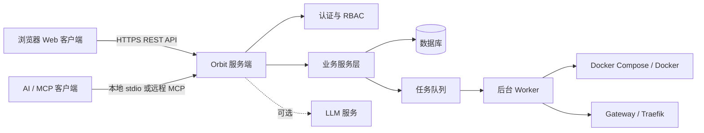
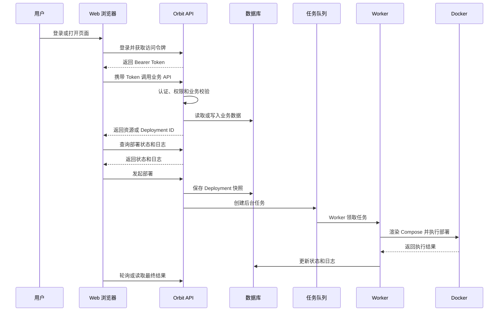
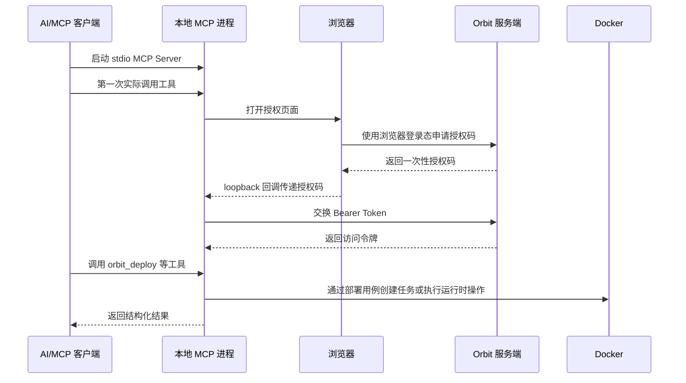
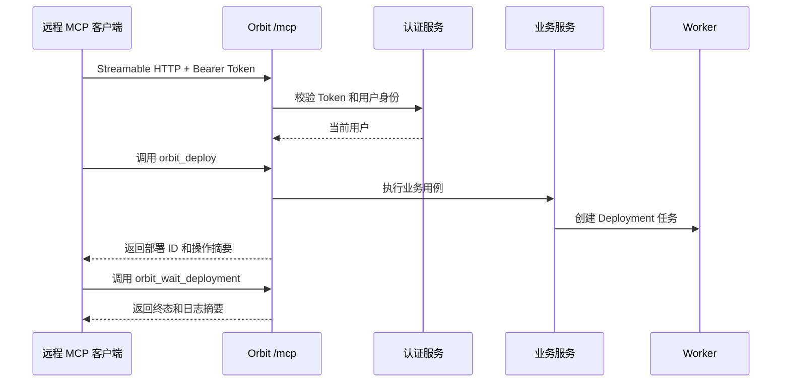
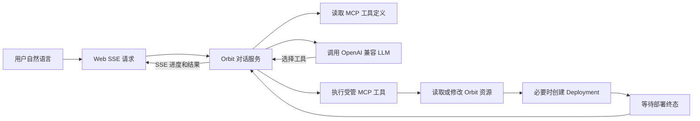

# 客户端与云端调用机制

最后修改时间: 2026-08-25

## 业务定位

Pomelo Orbit 是一个自托管的 CI/CD 与平台管理控制面。用户通过浏览器或 AI/MCP 客户端操作，Orbit 服务负责身份认证、权限校验、业务编排、任务调度和结果查询；后台 Worker 负责调用 Docker Compose 完成实际部署。

这里的“云端”指 Orbit 所在的服务端，可以部署在公有云、私有云或用户自己的服务器上，并不限定为公共 SaaS。

## 总体架构

## Web 客户端调用

浏览器负责页面展示和提交业务操作，不直接访问数据库、Docker 或运行时环境。

部署请求只负责创建任务和保存部署快照，不在 HTTP 请求中同步执行 Docker。客户端通过 Deployment 状态、日志和取消接口跟踪任务。

## MCP / AI 客户端调用

### 本地 stdio 模式

本地 AI 客户端启动 Orbit MCP 进程，通过标准输入输出调用工具。首次实际调用时，MCP 进程打开浏览器完成授权：浏览器使用已有登录态申请一次性授权码，MCP 进程通过本机 loopback 回调接收授权码并交换 Bearer Token，随后将凭据保存到本地配置目录。

本地 stdio 工具直接复用 Orbit 的 Go 业务服务，不再回环调用 Orbit HTTP API；但仍使用相同的权限和业务规则。

### 远程 MCP 模式

远程客户端连接 Orbit 的 `/mcp` 端点，使用 Bearer Token 建立 Streamable HTTP 会话。服务端在连接时校验身份，并创建绑定当前用户的 MCP 工具集合。

MCP 工具覆盖应用、版本、服务、Gateway、Route、Preview、Deploy、Stop、Restart、日志和运行时验证。客户端不能直接执行任意 Docker 命令，只能通过受管工具访问部署能力。

## 对话式部署

部署对话页面由 Orbit 服务端连接 LLM，并把受管 MCP 工具作为模型工具提供。浏览器只调用对话 API，不直接连接 LLM、MCP 或 Docker。

对话服务会把工具调用结果反馈给 LLM，形成有限轮次的编排；部署类操作要求等待 Deployment 进入终态后再返回最终答复。

## 一句话总结

客户端负责表达意图、发起调用和展示结果；Orbit 服务端负责认证、权限和业务编排；Worker 负责实际 Docker 执行。Web 和 MCP 是两种入口，但最终共享同一套业务模型、权限边界和部署流程。
