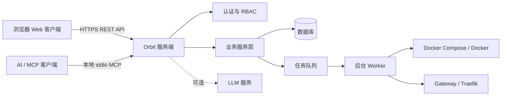
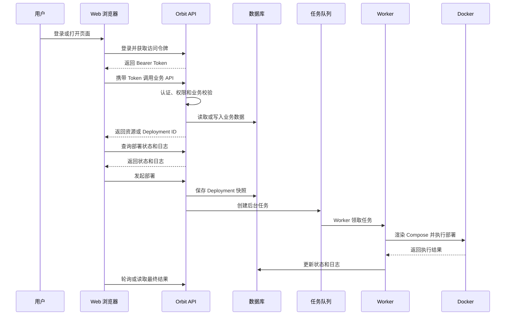
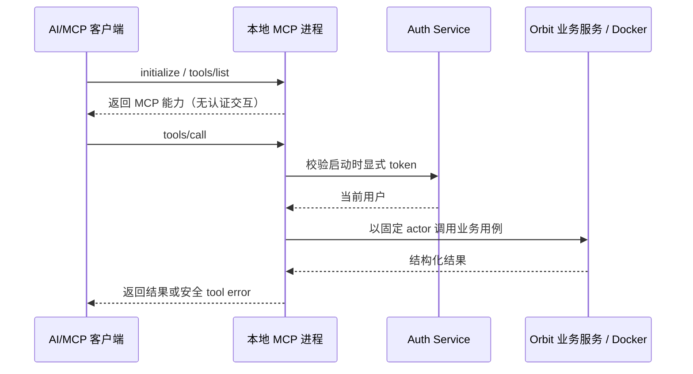
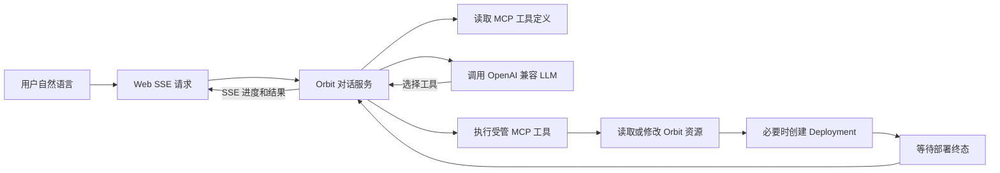

# 客户端与云端调用机制

最后修改时间: 2026-09-07 13:31:14

## 业务定位

Pomelo Orbit 是一个自托管的 CI/CD 与平台管理控制面。用户通过浏览器或 AI/MCP 客户端操作，Orbit 服务负责身份认证、权限校验、业务编排、任务调度和结果查询；后台 Worker 负责调用 Docker Compose 完成实际部署。

这里的“云端”指 Orbit 所在的服务端，可以部署在公有云、私有云或用户自己的服务器上，并不限定为公共 SaaS。

## 总体架构

## Web 客户端调用

浏览器负责页面展示和提交业务操作，不直接访问数据库、Docker 或运行时环境。

部署请求只负责创建任务和保存部署快照，不在 HTTP 请求中同步执行 Docker。客户端通过 Deployment 状态、日志和取消接口跟踪任务。

## MCP / AI 客户端调用

### 本地 stdio 模式

本地 AI 客户端启动 Orbit MCP 进程，并只通过标准输入输出调用工具。客户端初始化和工具发现没有认证交互或副作用。stdio 进程从 `POMELO_ORBIT_MCP__ACCESS_TOKEN` 读取启动时的 MCP PAT；每次 `tools/call` 都按其 SHA-256 摘要查找 token，并校验 token 未撤销、未到期、用户存在且 enabled，首次成功后还会固定 session actor，后续凭据不可切换到另一用户。token 缺失、撤销、过期、篡改或用户禁用时，工具返回安全的 MCP error，业务用例不会执行。PAT 不可作为 Web API 的 Bearer JWT 使用。

本地 stdio 工具直接复用 Orbit 的 Go 业务服务、项目成员检查和领域授权规则，不回环 Orbit HTTP API，也不打开浏览器、监听 loopback、交换授权码或缓存凭据。运行该进程的主机必须能够访问目标 Orbit 的同一数据库、签名配置、Docker 和 workspace；这不是远程 MCP bridge。

父进程更新 token 后必须重启 MCP session；运行中的 session 不热读环境、不续期，也不会自动撤销仍有效的旧 token。
## 对话式部署

部署对话页面由 Orbit 服务端连接 LLM，并把受管 MCP 工具作为模型工具提供。浏览器只调用对话 API，不直接连接 LLM、MCP 或 Docker。HTTP 入站认证得到的当前用户会为每个 turn 创建固定 actor 的内存 MCP session；不会把浏览器 `Authorization` 转发给 `/mcp`，模型输入也无法覆盖该 actor。

对话服务会把工具调用结果反馈给 LLM，形成有限轮次的编排；部署类操作要求等待 Deployment 进入终态后再返回最终答复。

## 一句话总结

客户端负责表达意图、发起调用和展示结果；Orbit 服务端负责认证、权限和业务编排；Worker 负责实际 Docker 执行。Web 和 MCP 是两种入口，但最终共享同一套业务模型、权限边界和部署流程。
