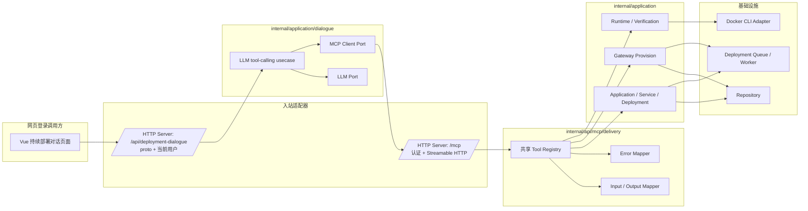

# Go 持续部署 MCP 改写计划
最后修改时间: 2026-08-06 09:09:55

Review status: Accepted

流程模式: 标准 / standard

## 需求依据

本计划实施已接受的 [Go 持续部署 MCP 改写](../requirement/20260805-go-delivery-mcp.md)。目标是将 Python 持续部署 MCP 迁移为 Go 实现，并统一对外名称为 `pomelo-orbit-mcp`，同时保持 stdio 与 Streamable HTTP 两种标准 transport、完整工具兼容性，以及所有业务 tool 直接调用 application usecase 的分层边界。

## 实施架构

### 基本流程

```mermaid
flowchart TD
    A[持续部署页面中的对话工作区] --> B[Proto 对话 HTTP API]
    B --> C[Dialogue application usecase]
    C --> D[LLM tool-calling loop]
    D -->|Go MCP Client + Authorization| E[/mcp]
    E --> F[Go Delivery MCP Core]
    F --> G[Application Usecases]
    G --> H[Repository / Workspace / Runtime Port]
    G --> I[Deployment Worker]
    I --> J[Docker Compose Runtime]
```

### 组件架构



```text
Vue 持续部署对话页 -> proto HTTP API -> dialogue usecase -> LLM tool loop
                                                           -> Go MCP Client + Authorization -> /mcp
                                                                                              |
                                                                             internal/api/mcp/delivery
                                                                                              |
                                                                             internal/application usecase
                                                                                              |
                                              repository / workspace / Docker runtime port / worker
```

`internal/api/mcp/delivery` 是唯一的 MCP Core，负责 tool 注册、schema、输入映射、输出投影和 MCP 错误映射。它不依赖 HTTP handler、repository 或基础设施实现。HTTP server 将认证 wrapper 与 `/mcp` Streamable HTTP handler 挂载：wrapper 复用现有 Bearer token 验证，按 MCP session 创建绑定当前用户 ID 的 Core。项目内 Go MCP client 必须透传该 `Authorization`。`internal/application/dialogue` 只依赖 LLM 与 MCP client port，基础设施层实现 OpenAI-compatible HTTP client 和 MCP Client adapter。Vue 调用 proto 对话 API，不直接调用 MCP。不配置固定 actor；无网页 stdio MCP 的认证接入不在本阶段实现。

## 工具迁移边界

| 工具分组 | 实施方式 |
| --- | --- |
| `orbit_list_*`、Application、Version、Component、Service 与 Deployment 生命周期工具 | MCP handler 调用现有 project、application、service、deployment、gateway usecase，并将 DTO/model 投影为现有 Python MCP 响应。 |
| `orbit_provision_gateway` | 在 `internal/application/gateway` 增加高层 `ProvisionGateway` usecase，封装查找/创建 Gateway、选择与发布 Version、准备 Service、发起 Deployment、等待与 `traefik` 网络检查；MCP handler 只调用该 usecase。 |
| `runtime_doctor`、`runtime_compose_*`、`runtime_container_inspect`、`runtime_network_inspect`、`runtime_http_probe` | 在 `internal/application/deployment` 补齐受管 runtime 查询 usecase 与 port。基础设施层实现 Docker CLI 适配；MCP handler 只调用 usecase。 |
| `verify_deployment` | 在 `internal/application/deployment` 增加验证用例，组合 Deployment、runtime target 与 probe 结果，保留 Python 版的摘要、`detail` 与领域结果语义。 |

## MCP 参数修正

Python MCP 将工具外层参数与 HTTP body 中的同名集合字段都命名为 `mounts`、`env`、`endpoints`、`dependencies` 等，导致调用方必须传入 `mounts: { mounts: [...] }`。具体而言，`version_specs.py` 的 `VersionComponentMountsUpdate` 包含 `mounts: list[LogicalMount]`，而 `orbit_update_version_component_mounts(..., mounts: VersionComponentMountsUpdate)` 再以同名参数接收该 model。随后 `mounts.model_dump()` 输出正确的 HTTP body `{ "mounts": [...] }`。

因此该问题只发生在 Python MCP 对外 schema，Web API、前端 `VersionComponentMountsUpdateReq` 直传和后端 JSON 解码均正常，不在本计划内修改。

Go MCP 对 Version Component 的 `env`、`endpoints`、`mounts`、`dependencies`、`devices`、`resources`、`tmpfs`、`ulimits`，以及 Service 的 `env` 使用扁平 tool 参数。MCP envelope 只定义版本、组件和服务 ID 等路由字段；业务字段直接使用 `internal/gen/proto` 的叶子 message，并映射为 application DTO。不复刻 Python wrapper DTO，也不改变底层 HTTP API body。

## 实施步骤

1. 引入 MCP SDK 并建立共享 Core。
   - 在 `go.mod` 引入并固定 `github.com/modelcontextprotocol/go-sdk`。
   - 新建 `internal/api/mcp/delivery`，定义依赖接口、`mcp.Server` 构造、MCP envelope、统一错误转换和不含凭据的响应投影。
   - 使用 `mcp.AddTool` 从 Go struct 生成 JSON Schema；将 Python 的工具名称、默认值、必填项和描述固化为测试目标。

2. 复用现有 application usecase 迁移生命周期工具。
   - 将项目、Application、Version、Component、Service、Deployment、Gateway 的读取与写入工具按资源分组迁移到 MCP Core。
   - 将 Python `version_specs.py` 的输入校验和 payload 投影收敛为生成 proto 叶子 message 到 application DTO 的映射。删除 `ComponentEnvInput`、`ComponentMountInput` 等重复 MCP 业务 DTO；不将顶层 HTTP request wrapper 引入同名 MCP 字段。
   - 对同名集合更新工具定义扁平 MCP input schema，例如 `mounts: []*applicationv1.ComponentMount`，而非 `mounts: { mounts: [...] }`；其 application DTO 映射仍生成既有集合字段。以 `orbit_update_version_component_mounts` 为基准，测试应同时断言 `tools/list` 中 `mounts` 的类型为 array，及 tool call 的 `mounts: [...]` 被原样映射到 `VersionComponentMountsUpdateInput.Mounts`。
   - 保留 `write_result`、`runtime_result` 的稳定字段、领域终态与结构化错误类别，移除 Python `OrbitClient` 与本项目 HTTP API 回环。

3. 补齐 Gateway 编排 usecase。
   - 在 gateway application 边界定义 `ProvisionGateway` 输入、输出和所需窄 port，保持现有唯一 Gateway、Version 选择、Service 复用、部署等待与 `traefik` 网络检查语义。
   - 通过 bootstrap 注入 deployment/runtime 协作能力，避免 gateway 与 deployment usecase 包产生循环依赖。
   - 将 `orbit_provision_gateway` handler 收敛为输入映射、调用 usecase 和结果投影。

4. 补齐受管 runtime 与验证 usecase。
   - 将 runtime target 解析、Docker prerequisite 检查、compose config/ps/logs、受限 container/network inspect 与固定 HTTP probe 定义为 deployment application usecase 和 port。
   - 在现有 deployment runner/infrastructure 边界实现 Docker CLI 适配，复用受管 workspace、组件和网络范围校验；不在 MCP adapter 拼接 Docker 命令。
   - 将 Python 验证算法迁移为 deployment application usecase，保持 `failed`、`drift`、`inconclusive`、timeout 等领域结果及 `detail` 投影。

5. 接入认证后的 Streamable HTTP transport 与 bootstrap。
   - 在现有 HTTP server 的顶层 `http.ServeMux` 挂载 `/mcp`。认证 wrapper 先验证当前 Bearer token，再按用户构造 Core 并交给 `mcp.NewStreamableHTTPHandler`；其余路径继续交由 Gin Web/API handler 和静态资源 fallback。
   - 在基础设施层提供 Go MCP client adapter，使用 `mcp.StreamableClientTransport` 连接 `/mcp` 并透传调用方 `Authorization`。
   - 移除全局 `mcp.actor_user_id` 和未认证的 `mcp` stdio 子命令。无网页标准 MCP 的认证接入在后续独立实现。

6. 实现部署对话 API 与页面入口。
   - 新增 `proto/orbit/v1/dialogue` 契约并生成 Go、Vue TypeScript DTO；对话请求包含页面保存的消息历史和本次用户输入，响应包含最终回答及本轮工具调用摘要。
   - 在 `internal/application/dialogue` 实现 LLM tool-calling usecase：读取 MCP tools、将 schema 传给 LLM、执行返回的 tool call、回填 tool result，直到得到 assistant reply。LLM 业务知识以固定系统提示和 MCP tool name/description/schema 为准，资源数据和实际部署操作均来自 MCP。
   - 在持续部署模块新增对话路由和页面。Vue 通过生成 API client 发送请求并展示消息与本轮工具摘要，不直接调用 `/mcp`；对话历史暂保留在页面内。
   - OpenAI-compatible endpoint、model、timeout 通过配置注入，密钥仅由运行环境提供；未配置时 API 返回明确错误。

7. 建立兼容性测试并完成切换。
   - 为 MCP Core 建立 in-memory transport 测试，覆盖 `tools/list`、所有工具 schema、关键读取/写入映射和错误投影；断言同名集合更新工具只暴露一层集合参数。
   - 为 Streamable HTTP 建立 `httptest` 覆盖，证明其工具表与 stdio Core 相同；为 `cmd/server mcp` 建立 stdio 启动测试。
   - 使用 Python 实现作为过渡基线，生成或维护 tool schema/响应 fixture，并以不同命令运行 Python/Go MCP 做对照。需要 Docker 的运行态测试沿用现有 docker marker 或隔离环境。
   - 将 `.codex/config.toml` 的 `pomelo-orbit-mcp` 由 Python `uv` 命令切换为 Go `mcp` 子命令；更新 MCP 指南、README、AGENTS 与 Claude Code 配置示例。
   - 确认 Go MCP 的注册与契约后，删除 `mcp/src/delivery-mcp/` 的 Python 实现及其 Python 专属工具链；保留 `mcp/src/pipeline-mcp/`。

## 预期文件

| 路径 | 计划改动 |
| --- | --- |
| `go.mod`、`go.sum` | 引入官方 Go MCP SDK。 |
| `configs/config.yaml`、`internal/config/config.go` | 不增加固定 MCP actor 配置。 |
| `internal/bootstrap/http.go` | 复用依赖装配，构造按当前认证用户绑定的 `/mcp` handler。 |
| `internal/api/http/server.go` | 在顶层 mux 挂载 Streamable HTTP MCP handler，保留既有 Gin handler。 |
| `internal/api/mcp/delivery/` | 新增 MCP Core、tool 注册、input/output mapper、错误映射及测试。 |
| `internal/application/gateway/`、`internal/application/deployment/` | 补齐 Gateway provision、runtime 诊断和验证 usecase/port/DTO/测试。 |
| `internal/infrastructure/runner/deployment/` | 实现新增 runtime/verification port 的 Docker CLI 适配。 |
| `.codex/config.toml`、`.claude/` 配置示例 | 无网页 MCP 认证方案明确后再更新。 |
| `mcp/src/delivery-mcp/` | 无网页 MCP 认证和契约对照完成后再删除；不修改 `pipeline-mcp`。 |
| `docs/guides/`、`mcp/README.md`、`AGENTS.md` | 无网页 MCP 接入后再补充对应操作说明。 |

## 验证计划

1. 运行 Go MCP 的单元与 Streamable HTTP transport 测试，断言认证后的请求使用当前用户创建 Core。
2. 对照 Python 基线验证每个 tool 的名称、schema、默认值、必填项、响应字段和错误类别；对包含副作用的 tool 使用 fake application services，不执行真实部署。
3. 对 runtime 与 verification usecase 覆盖受管 target 解析、非受管输入拒绝、Docker command 输出解析、`detail` 变化和领域终态。
4. 以带和不带 `Authorization` 的 Streamable HTTP client 分别验证发现工具和未认证拒绝；无网页 stdio 认证方案完成后再补标准 MCP client 检查。
5. 运行受影响 Go 包的 `gofmt`、`go vet`、`go test` 及项目既有 lint 入口；Python Delivery MCP 删除后确认不再被配置、文档或构建引用。

## 风险与回滚

1. Python 与 Go 的 schema 或结果字段不一致时，保持 Python MCP 注册不切换，修正 Go fixture 对照后重试。
2. Gateway 编排和 runtime/verification 新 usecase 仅移动现有行为；发现行为偏差时回退到 Python MCP 实现，不改变既有 HTTP API、Deployment worker 或持久化数据。
3. 删除 Python 实现只发生在无网页 MCP 认证方案、Go transport 契约和隔离端到端检查均完成之后；切换前保留 Python 源码和独立启动命令以支持回退。

## User review notes

1. 2026-08-05：用户确认完整补齐 runtime/verification 能力，保留高层 Gateway provision，并要求 Go MCP 同时服务标准 MCP client 与项目内 HTTP 服务。
2. 2026-08-05：用户要求在 Plan 中补充 Mermaid 基本流程和架构图，并明确 Plan 完成后进入 Implementation。
3. 2026-08-05：用户确认 Python MCP 的同名集合 wrapper 是已知问题；Go MCP 应修正为扁平参数，Web API 保持不变。
4. 2026-08-05：用户明确该问题的边界：Python MCP public tool parameter 与 `model_dump()` 的 HTTP body 同名而形成双层结构；Web body 与 handler 均无问题。该事实纳入 Go schema 和 DTO 映射的验收。
5. 2026-08-06：用户明确 Web 发起时 actor 必须是当前登录用户；取消固定 `actor_user_id`，无网页 MCP 的认证方案延后处理。
