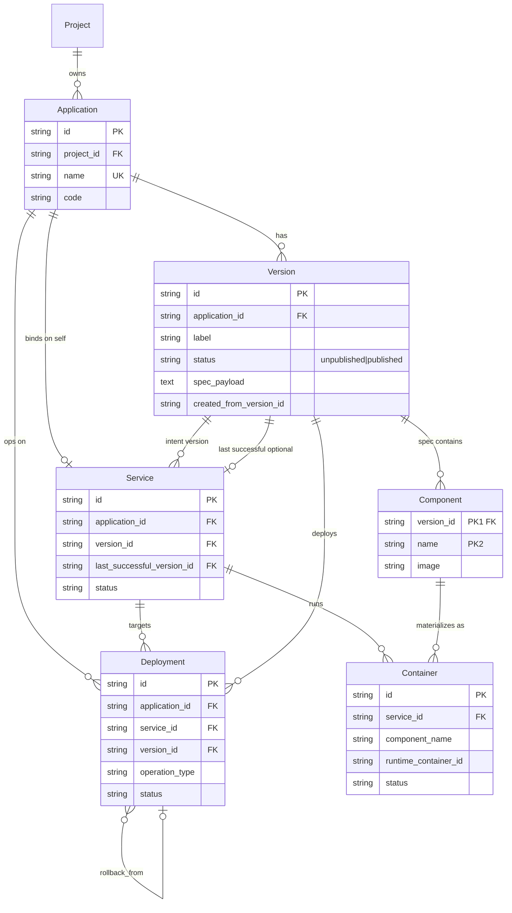

# CD 应用版本化：领域对象与部署语义
最后修改时间: 2026-07-22 08:35:55

Review status: Accepted

Flow mode: standard

Parent cadence: `docs/requirement/20260721-cd-application-version-cadence.md`（P0）

**修订 R1（Accepted）**：Environment 实体化、ExposeSpec、Service 基数与 Traefik MVP —— 以  
`docs/requirement/20260721-cd-environment-expose-service.md` 为准；与下文冲突时以 R1 为准。

**修订 R2（Draft / strict）**：Environment **接入策略 IngressPolicy** 取代用户侧 per-component **EnvironmentBinding** —— 以  
`docs/requirement/20260722-cd-environment-ingress-policy.md` 为准；R2 Accepted 后，与 R1 D4 Binding 用户 SoT 冲突时以 **R2** 为准。

## Terminology / 规范用词（Accepted）

| 中文 | 英文 | 说明 |
|------|------|------|
| 应用 | **Application** | 长期身份 |
| 版本 | **Version** | **业务数据**：从属于 Application 的静态规格（含 Component、ExposeSpec） |
| 环境 | **Environment** | **Project 下业务数据**；有 `project_id`；无 `application_id`（详见修订文档） |
| 部署 | **Deployment** | 一次 deploy/stop/restart 等操作的**记录**（状态、日志、结果） |
| 服务 | **Service** | **业务数据**：运行绑定（app + env + instance_key + 意图 Version + 状态） |
| 容器 | **Container** | Service 下由 Component 物化得到的运行实例 |
| 组件 | **Component** | Version 内规格单元（意图）；**不是** Container；**定名 Component，不用 Workload** |
| 暴露规格 | **ExposeSpec** | Version 内 http\|tcp + 端口；**无域名** |

约定：

- 动词 deploy / stop / restart —— 不是独立领域类型。
- **废弃** DeploymentRecord、ApplicationVersion、Release、Runtime Instance 作领域主名。
- **Deployment ≠ Service ≠ K8s Deployment**。
- **Version ≠ compose 文件**；compose/k8s 是 **render 结果**。
- 现表 `application_service` **不是**领域 Service → 过渡为 Version.Component。

## Background / 背景

现状 `application` + 可变配置 + `application.status` 混杂身份与运行态。  
P0 钉死对象、ER、生命周期与部署顺序。**非最终 DDL/proto**；语义与基数不得偏离。

## Goal / 目标

1. 区分 Application / Version / Environment(概念) / Deployment / Service / Container / Component。
2. 部署顺序：先 **Service**（绑 Version）→ 按关联 Version **渲染** → apply → 补齐 **Container（含 component 引用）**；并写 **Deployment**。
3. Version / Service 为业务数据；compose 仅为渲染结果。
4. 概念 UML ER：属性、主键/外键、基数无歧义。
5. **P0 无遗留 Open question**（实现细节归 P2/P3/Plan）。

## Non-goal / 非目标

1. 不定最终列类型、索引 DDL、JSON Schema 正则。
2. **不实现** Environment 实体、远程机、多环境。
3. 不实现产品代码、Version CRUD UI、deploy 改造。
4. Spec 字段细目 → **P1**；渲染/raw overlay → **P3**；本机 deploy 闭环细节 → **P2**。
5. 不实现完整密钥管理、TCP 暴露、K8s。

## User scenarios / 用户场景

1. 统一名词与 ER 评审。
2. 改 **未发布** Version；**已发布** 只读，改规格则 **新建 Version**。
3. 未发布与已发布 **均可 deploy**。
4. stop 后再 start：同一 Service.id。
5. 失败：在 Service 看整体态，Container 看实例，Deployment 看过程日志。

## Domain definitions / 领域定义

### Application

- 身份：id、project_id、name、code。
- 不承载编排真相、不承载运行状态。
- 可选：创建 Version 时的默认策略（如 image_pull_policy）；**非运行真相**。
- 拥有 0..N Version；0..N Service（按 env + instance_key）。

### Version —— 业务数据

- 完整静态规格；**结构化 SoT**，不是 compose 全文。
- status：
  - **unpublished**：可编辑、可部署。
  - **published**：不可编辑、可部署；变更只能 **新增 Version**（可 fork）。
- **不可** published → unpublished 回退。
- **本期不做** archived。
- label：人类可读版本号；**`(application_id, label)` 唯一**。

### Environment —— Project 下业务实体（修订 Accepted）

- **归属 Project**：必有 `project_id`；**无** `application_id`。
- 业务唯一建议：`(project_id, code)`；切换项目后只维护本项目环境。
- **禁止**跨 Project 部署引用：`application.project_id` 必须等于 `environment.project_id`。
- 承载**环境级接入策略**（域名推导、默认入口、TLS 等）；**不**以 Version component 为环境 CRUD 维度（见 R2）。
- R1 曾落地 EnvironmentBinding 用户表；**R2** 拟废止该用户 SoT，改为 IngressPolicy：`20260722-cd-environment-ingress-policy.md`。
- 基数与 MVP 细节见 `20260721-cd-environment-expose-service.md`（R1）。

### Deployment —— 操作记录

- **stop / restart / deploy（及可选 rollback）共用同一实体**；用 `operation_type` 区分。
- 每次操作新行；关联 application_id、service_id、version_id、**environment_id**（deploy/restart 必有 version+env；stop 记当时绑定）。
- 中文 UI「部署记录」= 此实体。

### Service —— 业务数据、状态主入口

- 意图绑定：version_id + **environment_id** + **instance_key** + status。
- 业务唯一：`(application_id, environment_id, instance_key)`；**允许多条**（一 App 多实例/多环境）。
- **首次 deploy 步骤 ① 即创建**；失败不删。
- stop = status=stopped，**不 DELETE**；id 稳定。
- **last_successful_version_id**（可空）：最近一次达到 `running` 的 Version；失败时 version_id 仍为意图版，此字段保留上次成功，供展示/回滚入口。
- Traefik：**运行**可多 Service；MVP **每 (app, env) 至多一个 ingress target**。

### Component

- Version 内规格单元；身份 **`(version_id, name)`**（或代理 id + 唯一约束）。
- 定名 **Component**（不用 Workload）。

### Container

- 运行实例；**自有 id**；`service_id` 为 FK；**component_name** 引用 Component。
- 一期 **可不落库**，由 runtime 派生，但 API/领域仍有 Container 概念且必须带 component_name。

## 部署顺序与转换（Accepted）

```text
① Service upsert（app + env + instance_key，绑 version_id，status=deploying）+ Deployment
② Render(Version + ExposeSpec, Environment + Binding) → compose 等产物（非业务源）
③ Runtime apply
④ 补齐 Container.component_name → Component；Service = running | faulted
```

禁止：先 compose up 再补 Service；禁止用磁盘脏 compose 绕过 Version；禁止仅用 ApplicationRoute(domain@app) 作为对外 SoT。

| 用户问题 | 看哪里 |
|----------|--------|
| 整体怎样？意图哪一版？ | **Service** |
| 哪个容器/health？ | **Container** |
| 这次操作日志？ | **Deployment** |
| 规格？ | **Version / Component** |

## Service / Deployment 状态（Accepted）

### Service.status

| 值 | 含义 |
|----|------|
| deploying | 正在 deploy/restart |
| running | 意图落实且就绪条件满足 |
| stopped | 用户 stop |
| faulted | 未落实或不健康 |

### 就绪条件（P0 钉死口径，实现细节 P2）

1. 若 Component **定义了 healthcheck**（见 P1）：以 **runtime 报告的 health**（如 Docker health）为准；任一侧 unhealthy / 超时未 healthy → Service=`faulted`。
2. 若 **未定义 healthcheck**：以 Container **running**（且未异常退出）为就绪。
3. **不做** 本期独立的平台主动 HTTP 探针体系（另开需求）。
4. compose 命令失败、容器未起、health 不过 → 一律 Service=`faulted` + Deployment 记原因。

### Deployment

| 字段方向 | 说明 |
|----------|------|
| operation_type | `deploy` \| `stop` \| `restart` \|（可选）`rollback` |
| status | 至少：`pending` / `running` / `succeeded` / `faulted`（与现网可对齐） |
| service_id | 步骤 ① 之后必有 |
| version_id | 操作相关版本 |

## UML ER / 概念模型



### 主键 vs 外键

| 实体 | 主键 | 外键/归属 |
|------|------|-----------|
| Component | **`(version_id, name)`** | version_id → Version |
| Container | **自有 id** | service_id → Service；component_name 逻辑引用 Component |
| Service | 自有 id | 业务唯一 `(application_id, environment_id, instance_key)`；version_id；last_successful_version_id 可空 |

### 关系与基数

| 关系 | 基数 |
|------|------|
| Application → Version | 1:N |
| Application → Service | **1:N**（唯一键含 env + instance_key） |
| Project → Environment | **1:N**（归属；`(project_id, code)` 唯一） |
| Environment → Service | 1:N（app 与 env 必须同 project） |
| Service → Version（intent） | N:1 |
| Version → Component | 1:N |
| Version → ExposeSpec | 1:N |
| Service → Container | 1:N |
| Component → Container | 1:0..N |
| Service → Deployment | 1:N |

### Container → Component 引用

- 字段：`component_name`
- 路径：`Service.version_id` + `component_name` → Component
- 孤儿（runtime 有、规格无）：标记异常/告警，不伪造 Component
- 缺失（规格有、runtime 无）：该 Component 下 0 Container，Service 可 faulted

## 生命周期（Accepted）

```text
deploy(Application, Version)
  ① Service upsert：version_id=目标；status=deploying；Deployment 关联
  ② Render(Version) → 产物
  ③ apply
  ④ Containers + component_name
     成功 → status=running；last_successful_version_id=version_id
     失败 → status=faulted；version_id 仍为意图版；last_successful 不变

stop → status=stopped；不删 id
restart → 同 deploy ②③④，version_id 默认不变
```

## 与现状映射

| 现状 | 目标 |
|------|------|
| `application` | Application |
| `application.status` | **废止为运行真相**；迁 **Service.status**（见决策：不双写产品语义） |
| 无 | Version、Service、Component |
| `deployment` | Deployment + version_id/service_id |
| `application_config_file` | 迁入 Version.spec（过渡） |
| `application_service` | Version.Component |
| `application_route` | **暴露子系统（另开）**，不进 P0/P1 最小闭环 |
| `docker compose ps` | Container（派生） |

## State boundary

| 对象 | 问题 | 状态 |
|------|------|------|
| Application | 是谁？ | 无运行状态 |
| Version | 规格？发布？ | unpublished / published |
| Deployment | 这次操作？ | pending/running/succeeded/faulted |
| Service | 意图版与整体？ | deploying/running/stopped/faulted |
| Component | 规格单元 | 无运行状态 |
| Container | 实例 | runtime 状态 |

## Acceptance / 验收标准

1. 用词与 ER 无歧义；Environment 概念不实现。
2. Version 业务数据；compose 渲染结果。
3. 部署顺序与 Component 引用写死。
4. Version 未发布/已发布规则写死；不可回退 unpublished。
5. Service 状态主入口；stop 不删；先建 Service 再渲染。
6. Deployment 统一承载 deploy/stop/restart。
7. 就绪/health 口径写死（runtime health 或 running）。
8. last_successful_version_id 语义写死。
9. **Open questions 为空**（实现项归 P2/P3）。

## Open questions / 待确认

**无。** P0 范围已闭合。下列事项**明确不在 P0**，不作为本文件遗留：

| 项 | 归属 |
|----|------|
| Version.spec 字段细目 | **P1** |
| 本机 deploy、**部署操作选项**（force recreate 等，非 Version） | **P2** |
| Version → 引擎产物的渲染实现 | **P3**（**无** raw compose 产品路径） |
| 域名/端口/路由等对外访问 | **本期不做**（见下） |
| 多环境 / 远程机 / K8s | **另开** |
| DDL/API/UI | **Plan / 实现** |

**「对外访问」说明（非「暴露子系统」品牌）**：指现状给应用配域名/端口、经 Traefik 引进流量（如 `application_route`）。与 Version 规格解耦；**本版本化需求不包含改它**。

## Decisions / 决策（P0 闭合）

1. 用词 Accepted；**Component** 定名（不用 Workload）。
2. 只留 **Deployment**；deploy/stop/restart **共用**，`operation_type` 区分。
3. Environment 仅概念；隐式本机。
4. Version = 业务结构化规格；compose = 渲染结果。
5. 部署顺序：Service → Render(Version) → apply → Container+component_name。
6. Version：unpublished/published；均可部署；published 不可改、**不可回退**；变更靠新 Version；无 archived。
7. Service：业务数据；状态主入口；stop 不删；id 稳定；Application 上 0..1。
8. 首次 deploy **先建 Service**；失败 `faulted` 保留；`version_id`=意图版。
9. **last_successful_version_id** 必有语义（可空字段）：仅成功 running 时更新。
10. Container：**自有 id**；一期可不落库、runtime 派生；必须能表达 component_name。
11. Component 主键 **(version_id, name)**；Container 主键 **不是** service_id。
12. Health：**一期采用 runtime health/状态聚合**；无平台独立探针。
13. **域名/路由对外访问不进**本领域闭环；本期不做。
14. **deploy 必选 Version**（Version 是部署前置）。
15. **放弃历史兼容**；不做旧「部署当前文件」/双轨/兼容层；大版本直接以 Version 路径为准。
16. force recreate 等为 **部署选项**，不进 Version。
17. **无 raw compose** 业务概念；产物仅渲染生成。
18. **`application.status` 不双写**；Service.status 为运行真相。
19. 概念 ER 非最终 DDL。

## Risk / 风险

1. 英文撞名：Service vs compose services；Deployment vs K8s Deployment → 文档/API 语境限定。
2. 过渡期脏 compose 架空 Version。
3. published 被绕过修改。
4. 派生 Container 未带 component_name 导致断链。

## Assumptions / 假设

1. 一期 runtime = Docker Compose（P2/P3 落实）。
2. 单机单 Service/Application 足够本期。
3. Component.name 与 compose service 名可对齐（渲染约定）。

## User review notes

- 2026-07-21：术语、Deployment 唯一、Service 不删、Environment 概念、Version 业务数据、部署顺序、Component 引用与主键澄清。
- 2026-07-21：**P0 闭合**；并按用户澄清：Version 部署前置、无旧兼容、操作选项属部署、无 raw、对外访问=域名路由且本期不做。
- 2026-07-21：用户 **接受 P0**；明确 **可放弃历史兼容**。
- 2026-07-21：**更正** Environment 归属 Project（否决松散）；以 `20260721-cd-environment-expose-service.md` 为准（R1）。
- 2026-07-22：挂入 **R2** 指针 `20260722-cd-environment-ingress-policy.md`（接入策略；Draft / strict）。