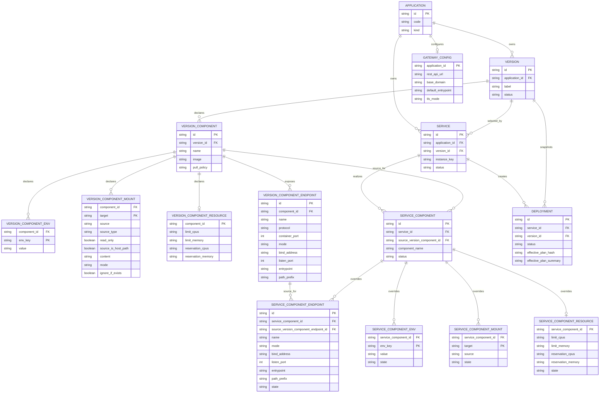

# Gateway Runtime Policy Boundary
最后修改时间: 2026-08-02 13:06:01

Review status: Accepted

## Requirement basis

本规格依据 `docs/requirement/20260731-gateway-runtime-policy-boundary.md`。目标是在保留 Application -> Version -> VersionComponent -> Service 生命周期的前提下，消除 VersionComponentPort 与 ServiceExpose 的重复宿主机端口表达，并建立可扩展到目录挂载、资源配额等运行时调整的核心模型。

## Overview

采用三个层次的期望状态：

```text
Effective service plan
  = Version Component declaration
  + ServiceComponent sparse runtime overlay
  + Gateway platform policy
```

Version/Component 是镜像使用方式的可复用声明，包含可继承的运行参数默认值，但不直接保存某个 Service 实例的最终宿主机端口、实际目录或资源数值。Service 选择一个 Version，并以统一语义的稀疏 overlay 提供运行时差异。GatewayConfig 是平台策略，不是第二份容器运行时配置。

## Design decisions

### 1. VersionComponent / ServiceComponent 双层聚合

`VersionComponent` 及其 `version_component_xx` 子表是镜像使用方式的声明树。Service 选择 Version 后，为每个可运行 Component 建立一个 `ServiceComponent`；`service_component_xx` 子表保存该实例实际如何使用声明树的运行时 overlay。

`ServiceComponent` 至少包含 `service_id`、`source_version_component_id`、`component_name` 和状态。它既提供稳定的 Service 内组件标识，也保留当前引用的 VersionComponent 审计来源。Service 切换 Version 时，必须按 `component_name` 原子重建或重映射 ServiceComponent；不能静默丢弃任何不兼容的子配置。

“对应”不表示完整复制。ServiceComponent 为每个 VersionComponent 子能力建立同构的 Service 子表；镜像、命令、依赖、健康检查、挂载 target、权限、容器端点协议等 Version 契约不在 Service 中复制。Service 只改写 Version 已声明配置中的值字段：修改写入差异，删除写入 tombstone，不新增未声明的环境变量、挂载、资源项或 Endpoint。

Service 子表只持久化与 Version 默认值不同的覆盖项。缺失记录代表继承 Version 默认值，禁止为了“保存当前状态”复制一份完整 Version 配置。其持久化不变量如下：

1. `service_component` 是 Service 到 VersionComponent 的稳定映射；它不是 VersionComponent 的副本。
2. `service_component_env`、`service_component_mount` 和 `service_component_endpoint` 的每一行都必须代表一个有效差异；写入与 Version 默认值相同的值必须规范化为删除该行。
3. `service_component_resource` 的每个可覆盖字段均可空，空值表示继承 Version 值；整行所有字段都为空时必须删除该行。不得以默认数值填充未覆盖字段。
4. Service 详情的配置修改与删除沿用现有 Component 详情交互。删除有效配置时持久化 `state=deleted` 的 tombstone；没有 Service 子表记录始终表示继承 Version，不能表示删除。未来的“恢复默认”通过删除 `state=deleted` 或 `state=override` 的 Service 子表记录实现，不等同于本轮的运行时删除操作。
5. `state` 是 Service overlay 的通用元数据，不是运行参数字段。Service 子表只持久化相应 Version 子表中可改写的同名值字段。`state=override` 时至少一个值字段必须与 Version 不同；`state=deleted` 时所有运行参数字段必须为空。

#### Runtime adjustment matrix

| 能力 | VersionComponent 声明 | ServiceComponent overlay | 不可由 Service 覆盖的部分 |
|---|---|---|---|
| 环境变量 | `env_key` 与默认 `value` | 已声明 `env_key` 的 `value` 或 `state=deleted` | 新增 `env_key`、Component 命令 |
| 目录/文件挂载 | target、source_type、读写权限和 source | 已声明挂载的 `source` 或 `state=deleted` | 新增挂载、修改声明挂载的 target/type/权限 |
| CPU/内存配额 | 默认 limit/reservation 数值 | 已声明资源项的 limit/reservation 数值或 `state=deleted` | 新增资源项或资源维度 |
| Endpoint | name、protocol、container_port，以及 mode、监听地址/端口或路由参数 | 已声明 Endpoint 中不同于 Version 的值字段或 `state=deleted` | 新增 Endpoint、Component 端口号和协议 |
| 镜像与执行方式 | image、pull_policy、command、dependency、healthcheck | 不适用；通过选择不同 Version 改变 | 全部 |

目录或配额的 ServiceComponent overlay 发生变化时，不产生新的 Version；它以同一个 Version 创建新的 EffectiveServicePlan 并在用户显式部署时生效。Version 子能力的默认值或不可覆盖契约发生变化时才需要创建或派生 Version。

这种稀疏 overlay 是未来“显示默认值、显示已覆盖字段、恢复默认值”的基础：恢复默认等价于在同一 Service 更新事务中删除对应 `service_component_xx` 覆盖记录，然后重新部署。它与本轮“删除有效运行时配置”不同，后者写入 `state=deleted`。恢复默认的专门 UI 不属于本轮实施范围。

### 2. Component Endpoint 是声明，ServiceComponent Endpoint 是同构的稀疏覆盖

`VersionComponentPort(host_port, container_port)` 应演进为一对同构的 Component 子能力，而不是由 Service 侧拥有独立端口真相：

- `VersionComponentEndpoint`：Version 声明容器接口及可继承的运行参数，包含 `name`、`protocol`、`container_port`、排序信息、`mode`、监听地址/端口和路由参数。这里的监听端口是模板参数，不是某个 Service 的绑定事实。
- `ServiceComponentEndpoint`：与来源 `VersionComponentEndpoint` 对应的 Service 级 overlay；它沿用 Version Endpoint 的可覆盖字段定义，`mode`、监听地址/端口、入口和路径字段均可空，空值表示继承。所有字段合成后才是唯一能够产生 Compose `ports`、Traefik 标签或本地监听的 Effective Endpoint。

建议的 Endpoint 参数：

| 字段 | 含义 |
|---|---|
| `name` | Version Endpoint 与 Service overlay 的稳定匹配键 |
| `protocol`、`container_port` | Version 所有的容器接口契约，Service 不可覆盖 |
| `mode` | `internal`、`local`、`host`、`gateway_http` 或 `gateway_tcp`；Version 提供模板值，Service 可覆盖 |
| `bind_address` | `local` / `host` 的宿主机监听地址；Service 仅存与 Version 值不同的值 |
| `listen_port` | `local` / `host` 的宿主机端口；Service 仅存与 Version 值不同的值 |
| `path_prefix` | `gateway_http` 的路由路径；Service 仅存与 Version 值不同的值 |
| `entrypoint` | Gateway 路由使用的入口；Service 仅存与 Version 值不同的值 |

`local` 约束为 loopback 地址；`host` 是直接宿主机绑定；`gateway_http` 和 `gateway_tcp` 只生成路由，不映射业务容器的宿主机端口。字段按 Effective Endpoint 的 `mode` 严格互斥，避免当前 `ServiceExpose` 同时承担路由和端口映射而语义模糊。Version 未提供默认值时，平台默认 `internal`；没有 `service_component_endpoint` 行即完整继承 Version Endpoint。若有 `state=override` 的 Service 行，其中每个非空字段都必须与来源默认值不同，全部为空时必须删除该行。`state=deleted` 表示保留容器接口契约但强制 Effective Endpoint 为 `internal`，不产生端口映射或路由。

这里没有 Endpoint 专属的持久化例外：它与其他 `service_component_xx` 一样只保存差异。`protocol` 和 `container_port` 是不可覆盖的接口契约；mode、地址、端口和路由字段均可由 Service 覆盖。配置保存仅校验引用关系、字段类型和同一 Endpoint 的字段组合；Gateway 可用性、端口冲突、entrypoint 存在性、域名或网络策略均推迟到 Preview/Deploy 的部署处理，不阻止用户保存运行时意图。

Gateway Service 的 Traefik ServiceComponent 的 `web`、`websecure`、`api` 等 Endpoint 都遵从同一合成规则：Version 为它们提供模板参数，Service 仅在需要时覆盖。网关创建时 `api` 可以使用 `internal` 作为初始声明值，但后续 Version 或 Service Endpoint 更新可按通用规则改写 mode、监听地址和端口；EffectiveServicePlan 不根据 `kind=gateway` 或 Endpoint 名称重新归一 mode。Gateway 编译器从 Effective Endpoint 生成 Traefik `entryPoints` 和对应的 Compose 端口映射；它们不是独立的 GatewayEntrypoint 持久化真相。

### 3. Gateway 仅提供平台策略和受控投影

保留 `kind=gateway`，但其职责限于选择 Gateway 平台策略：共享 `traefik` 网络所有权、`rest_api_url`、基础域名、TLS 默认策略、Dashboard 规则和 Traefik 受控静态配置。GatewayConfig 变更重新合成 EffectiveServicePlan 并重新部署 Gateway Service，不派生或修改 Version。

Gateway 不再通过通用渲染器的布尔参数重写 Component 的端口语义。Gateway 专属的计划构造器读取 Gateway Service 的 Effective Endpoint，生成：

1. 外部 bridge 网络 `traefik` 的拥有者声明；
2. Traefik 静态配置中的入口和 `providers.rest`；
3. Gateway Dashboard 标签；
4. 受控 Docker socket 与 ACME 挂载。

Gateway 部署前，既有 `traefik` 网络必须使用 `traefik` 作为 Compose 网络键和
`com.docker.compose.network` 标签值；不满足该前置条件时，部署应失败并要求先完成受控的就地网络迁移，不得通过 renderer 兼容多个网络键。

之后通用 Compose renderer 只消费 `EffectiveServicePlan`，不再判断 Application kind 来决定端口是否渲染或网络如何挂载。

### 4. 统一的 EffectiveServicePlan

新增内部只读投影 `EffectiveServicePlan`，包含已解析 Component、ServiceComponent overlay、Effective Endpoint 和平台拓扑。建议结构如下：

```text
EffectiveServicePlan
  components: EffectiveComponent[]
  endpoints: EffectiveEndpoint[]
  topology: PlatformTopology
  generated_files: ControlledFile[]
  fingerprint: string
```

生成步骤：

1. 加载 Service 选择的 Version、Component 声明和对应的 ServiceComponent。
2. 对每个 Component 合成稀疏 ServiceComponent overlay；未覆盖字段继承 Version 默认值，`state=deleted` 显式压制该默认值。
3. 校验 ServiceComponent Endpoint 只引用当前 VersionComponent 的 Endpoint，并检查字段类型、协议和同一 Endpoint 内的字段组合；随后合成 Effective Endpoint。端口冲突、Gateway 可用性和网络策略不阻止配置保存，由 Preview/Deploy 在部署阶段处理。
4. 由 Gateway 平台策略构造 `PlatformTopology`；Gateway Service 时再生成受控 Traefik 文件。
5. renderer 只将 EffectiveServicePlan 投影为 Compose。部署记录保存使用的 Version、Effective Endpoint 快照、规范化 `fingerprint` 和渲染摘要。

Version 切换时必须重新验证全部 ServiceComponent overlay 和 Endpoint overlay；缺失或不兼容的覆盖应在持久化 Service 选择前报错，不能留到异步部署失败。

## Domain model changes

### ER diagram



`SERVICE_COMPONENT` 持久化当前 `source_version_component_id`，同时用 `component_name` 完成
Version 切换时的稳定重映射。其 `env_key`、mount `target` 和 endpoint `name` 必须分别匹配
来源 VersionComponent 的声明。`service_component_endpoint` 的 Service 字段可空；`state=override` 时每个非空值
都必须不同于来源 Endpoint 的默认值，整行无差异时不持久化。`state=deleted` 时运行参数字段必须为空，
Effective Endpoint 固定为 `internal`。Endpoint overlay 或 Version 切换失配时拒绝写入。

`version_component_endpoint` 的 `(component_id, name)` 和 `service_component_endpoint` 的
`(service_component_id, name)` 均为稳定唯一键；Service Endpoint 通过
`source_version_component_endpoint_id` 保留当前来源记录，Version 切换时按名称重新映射并校验。

所有 `service_component_xx.state` 仅允许 `override` 和 `deleted`。不存在的 Service 子记录代表
`inherit`，不将其持久化为第三个状态。`override` 或 `deleted` 必须匹配 Version 已声明的 env key、
mount target、resource 项或 Endpoint name。网络相关配置的可用性和冲突在 Preview/Deploy 时处理，
不在配置保存阶段阻止用户。

### New normalized tables

| 表 | 责任 |
|---|---|
| `version_component_endpoint` | Version Component 的容器端点契约及可继承的默认运行参数；未设置 mode 时平台默认 `internal` |
| `service_component` | Service 对当前 VersionComponent 的实例级运行时组件 |
| `service_component_env` | 已声明 Version 环境变量的运行时值差异，或删除其默认值的 tombstone |
| `service_component_mount` | 已声明 Version 挂载 source 的差异或删除 |
| `service_component_resource` | 已声明 Version 资源项的运行时限额/预留值差异，或删除默认资源配置的 tombstone |
| `service_component_endpoint` | 已声明 Version Endpoint 参数的字段级稀疏覆盖，或禁用其运行时暴露的 tombstone |

### Retired or migrated fields

| 现有字段/表 | 迁移目标 |
|---|---|
| `version_component_port.host_port` | 迁移为 `version_component_endpoint.listen_port`；它是 Version 模板参数而非 Service 绑定事实 |
| `version_component_port.container_port` | 迁移至 `version_component_endpoint.container_port` |
| `service_expose` | 迁移为 `service_component_endpoint` 的差异字段，并在同一次迁移中移除 |
| `service.runtime_config_json` | 按已声明的 Component 子能力迁移为对应 `service_component_xx`，并删除与 Version 默认值相同的冗余项；无法安全映射的值使迁移失败 |
| `gateway_config.image` | 迁移为 Gateway VersionComponent 的 `image` 后删除；Gateway 初始创建必须在 VersionComponent 中显式给出镜像 |
| `application.image_pull_policy` | 补齐现有 VersionComponent 的 `pull_policy` 后删除；运行时仅以 Component `pull_policy` 为准 |

`ServiceComponent` 同时保存当前 `source_version_component_id` 和稳定的 `component_name`。Version 切换时，以名称重映射到新 VersionComponent 并重新校验每个稀疏子覆盖；映射失败时拒绝切换而不是删除覆盖记录。

## Interface changes

1. Version Component HTTP/Proto/MCP 接口声明 `version_component_xx` 的模板值与 Endpoint 容器接口契约；删除 `host_port` 输入。
2. Service HTTP/Proto/MCP 接口提供 ServiceComponent 的完整读取，以及 `service_component_xx` 的稀疏覆盖读写：修改只接受 Version 已声明条目的值字段，并将等于默认值的请求规范化为删除覆盖记录；删除有效配置写入 `state=deleted`。Endpoint 覆盖必须使用 `service_component_endpoint`，不再分别维护 ServiceExpose 与端口映射。
3. Preview、deploy、runtime compose config 都返回或使用同一 EffectiveServicePlan 摘要与规范化 fingerprint，避免预览和真实部署的渲染分歧。Deployment 保存已部署 fingerprint；Service 配置读取接口返回当前 fingerprint、最近成功部署 fingerprint 与 `pending_deploy`。
4. Service 配置读取接口返回每个 ServiceComponent 的 Version 声明、Service overlay、Effective Component 和来源状态。前端不得自行合成有效配置，也不得从旧 `runtime_config_json` 或 `service_expose` 推断。
5. 前端 Version 页面展示 Component 声明和模板值；Service 页面展示实际 overlay 及其来源 Version。有效配置应明确标识“来自 Version”“来自 Service 覆盖”或“已在 Service 删除”。

## Service configuration UI

### Information architecture

Service 详情页保留服务基本信息、部署、停止、日志和运行状态。现有扁平的“运行时配置”与“接入暴露”区块由“组件配置”入口替代：它列出当前 Service 选择 Version 的全部 Component，并显示 Component 名称、镜像、覆盖项数量、删除项数量和配置是否待部署。选择任一 Component 后进入 `ServiceComponentDetail`。

`ServiceComponentDetail` 沿用 `VersionComponentDetail` 的信息组织，而不是另建一套配置分类：

| 标签页 | 展示内容 | 可编辑范围 |
|---|---|---|
| Runtime | 基础执行信息、健康检查、环境变量、资源配额 | 已声明环境变量和资源项的值字段 |
| Connectivity | Endpoint 契约、模板监听/路由参数和有效发布结果 | 已声明 Endpoint 的 mode、监听地址/端口、entrypoint、path prefix |
| Mounts | 挂载 target、类型、权限、模板 source 与有效 source | 已声明挂载的 source |
| Advanced | 依赖、设备、tmpfs、ulimit 等 Component 声明 | 本轮只读；通过派生 Version 修改 |

基础执行信息、镜像、命令、依赖、健康检查、容器端口协议和挂载 target 等 Version 契约在 Service 页面保持只读。这样用户可以在相同的分块结构中比较 Version 与 Service，而不会误把运行时编辑理解为修改 Version。

### Value presentation and operations

每个可运行时调整的行或资源字段都同时呈现三个值：Version 模板值、Service 覆盖值和 Effective 值，并带来源状态：`inherited`、`override` 或 `deleted`。读取接口给出这三个视图及权限，前端不按空值推断状态。

- `inherited`：显示 Version 值，Service 列显示“继承”。
- `override`：显示 Service 差异和合成后的 Effective 值；编辑对话框预填当前 Effective 值，并展示不可修改的 Version 契约与可选边界。
- `deleted`：显示 Version 原值和“已在 Service 删除”；Effective 列显示该配置不生效。Endpoint 的 Effective 状态为 `internal`，不发布端口或路由。

交互沿用现有 Component 详情的表格行操作和资源编辑对话框：已声明条目的值字段提供编辑与删除。删除确认必须说明它会压制 Version 默认配置并在下次部署生效；操作写入 `state=deleted`，不会删除 Version 记录。Service 不提供任意键、任意挂载或任意端口的自由新增；所有覆盖都必须定位到 Version 已声明的条目。网络配置保存不因端口冲突或 Gateway/域名/网络策略而被阻止，这些问题推迟到 Preview/Deploy。

“恢复 Version 默认值”由删除 Service overlay/tombstone 实现，模型已经支持，但专门的 UI 操作不在本轮范围内。

### Deployment feedback

保存、修改或删除 Service 配置只更新期望运行状态，不自动重启正在运行的 Service。页面在组件配置入口和详情页显示服务端返回的“待部署”状态：当前 EffectiveServicePlan fingerprint 与最近成功部署的 fingerprint 不同时为待部署。用户使用既有 Deploy 操作使新的 EffectiveServicePlan 生效。保存成功提示应明确需要重新部署，Preview 必须展示待部署的 EffectiveServicePlan。

## Product and industry alignment

该设计沿用主流控制面分层：Kubernetes 的 PodTemplate 声明容器镜像和 `containerPort`，Service 选择并发布 `targetPort`，Gateway/Ingress 管理入口和路由。宿主机 `hostPort` 是特殊运行时参数，不能与容器 `container_port` 混为同一字段；Version 可以提供模板默认值，Service overlay 再按字段覆盖，最终由 Effective Endpoint 生成实例事实。

对用户而言，Version 是可复用的发布模板，Service 是每个实例的实际运行意图。用户能在 Service 页面改变数据目录、资源配额和公开方式，而不会误以为这些变化修改了所有引用该 Version 的 Service；需要固化运行方式时，再创建或派生新 Version。

## Development schema initialization

本变更直接修改原始 SQLite/MySQL DDL，不提供双读、旧 HTTP/Proto/MCP API 适配、旧 renderer 回退或历史数据转换。

1. 在 `000023_application`、`000025_gateway`、`000026_service` 和 `000027_deployment` 的原始 DDL 中定义 Endpoint、ServiceComponent 与 deployment fingerprint 的最终 schema，并删除旧字段/表定义。
2. 开发数据库从空库重建并运行现有 migration 序列，schema 版本保持 `30`；不新增 `000031`，也不迁移旧端口、Expose、runtime JSON 或 Gateway `api` 的历史值。
3. 数据库、HTTP/Proto/MCP、前端和 renderer 作为一个部署单元读取新模型；不得保留旧字段或兼容读取。
4. Gateway 部署前运行网络前置检查。若既有 `traefik` 网络的 Compose 网络键或标签不是 `traefik`，当前网络状态不满足时不得继续部署。

## Risks

1. Version 切换需要严格校验 Service Endpoint overlay，否则历史 Service 会因 Endpoint 名称或默认参数变化失效。
2. Service 修改或删除已声明挂载、环境变量和资源配置可能造成运行时不可用；该意图允许保存，应在 Preview/Deploy 中清晰报告其结果。
3. 资源配额参数必须有类型、上下限和部署时的 Docker 能力校验，不能作为任意字符串透传。
4. 开发数据库重建后不保留历史 schema 或数据的应用内回退路径。
5. Gateway 迁移涉及 `80/443`、ACME 和共享网络；须先在隔离 Docker 环境执行标签复用、Effective Endpoint 和 REST 路由的集成验证。

## Alternatives

### 保持当前双模型

拒绝。VersionComponentPort 与 ServiceExpose 继续重叠，且无法自然覆盖挂载和资源的 Service 级调整。

### 允许 Service 保存任意 Component 覆盖 JSON

拒绝。它会让 Service 成为 Component 的无类型副本，破坏 Version 的可复用性、验证和审计能力。

### 删除 Version 端点声明，只允许 Service 指向任意容器端口

不推荐。实现较快，但失去 Version 对可公开接口的校验和变更审计；除非产品明确选择完全自由的运行时绑定，否则采用 Endpoint 契约。

## Technical questions

暂无需要用户确认的未决事项。

## User review notes

- 用户要求将当前端口问题扩展为可支持目录挂载、资源配额等运行时调整的核心领域抽象设计。
- 用户确认不保留兼容层；开发数据库重建后使用更新的原始 DDL，旧 schema、旧 API 和旧渲染路径不作为运行时回退来源。
- 用户确认 Service 只改写 Version 已声明配置的值字段，不新增未声明的子配置；网络可用性与冲突延后到 Preview/Deploy 处理，不阻止配置保存；Gateway `api` 沿用通用 Endpoint 语义，首期不增加单独的覆盖变更审计。
- 用户要求 Service UI 以 Version Component 相同的分块组织运行时配置，并支持已声明值字段的改写与删除。
- 用户接受本规格，随后接受 Plan 并要求开始 Implementation / 实现。
